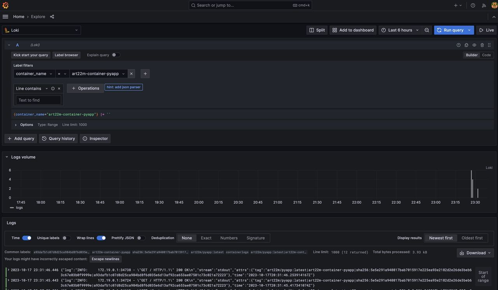
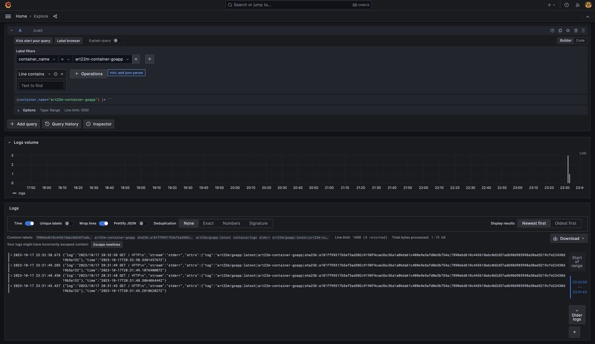
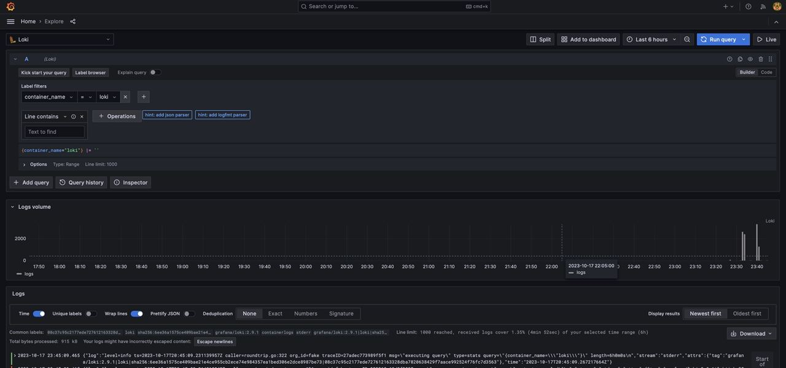
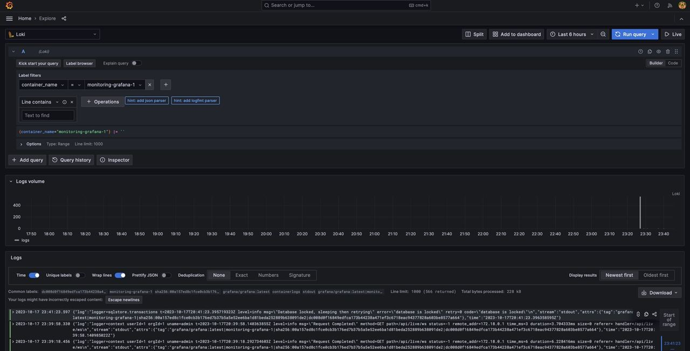
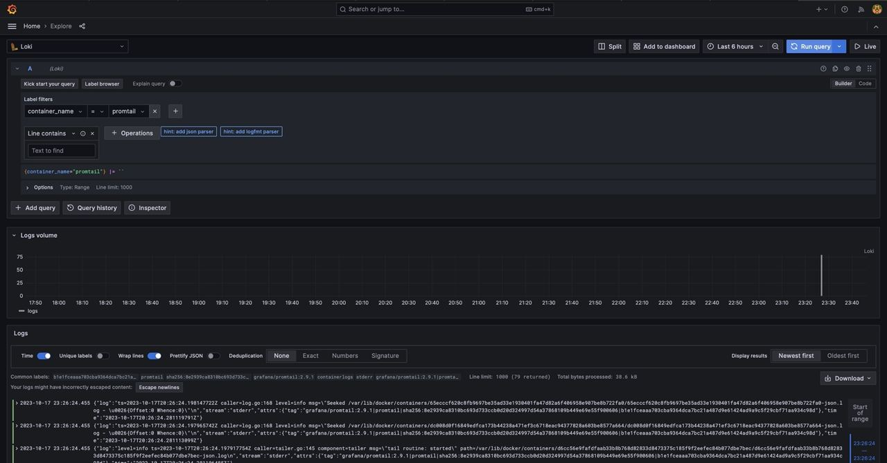

# Logging

## Logging stack
1. Grafana - open source interactive data-visualization platform.
```
environment:
    - GF_PATHS_PROVISIONING=/etc/grafana/provisioning
    - GF_AUTH_ANONYMOUS_ENABLED=true
    - GF_AUTH_ANONYMOUS_ORG_ROLE=Admin
entrypoint:
    - sh
    - -euc
    - /run.sh
volumes:
    - ./datasources.yml:/etc/grafana/provisioning/datasources/datasources.yaml
image: grafana/grafana:latest
ports:
    - "3000:3000"
networks:
    - loki
logging:
    driver: "json-file"
    options:
    tag: "{{.ImageName}}|{{.Name}}|{{.ImageFullID}}|{{.FullID}}"
```

2. Loki - log aggregation system designed to store and query logs from all your applications and infrastructure.
```
image: grafana/loki:2.9.1
container_name: loki
ports:
    - "3100:3100"
command: -config.file=/etc/loki/local-config.yaml
networks:
    - loki
logging:
    driver: "json-file"
    options:
    tag: "{{.ImageName}}|{{.Name}}|{{.ImageFullID}}|{{.FullID}}"
```

3. Promtail - agent that ships the contents of local logs to a private Grafana Loki instance
```
image: grafana/promtail:2.9.1
container_name: promtail
volumes:
    - /var/lib/docker/containers:/var/lib/docker/containers
    - ./promtail.yml:/etc/promtail/config.yml
command: -config.file=/etc/promtail/config.yml
networks:
    - loki
logging:
    driver: "json-file"
    options:
    tag: "{{.ImageName}}|{{.Name}}|{{.ImageFullID}}|{{.FullID}}"
```

## Apps to log
### Python
```
image: art22m/pyapp:latest
container_name: art22m-container-pyapp
ports:
    - "8000:8000"
logging:
    driver: "json-file"
    options:
    tag: "{{.ImageName}}|{{.Name}}|{{.ImageFullID}}|{{.FullID}}"
```

### Go
```
image: art22m/goapp:latest
container_name: art22m-container-goapp
ports:
    - "9000:9000"
logging:
    driver: "json-file"
    options:
    tag: "{{.ImageName}}|{{.Name}}|{{.ImageFullID}}|{{.FullID}}"
```

## Images

### Python-app


### Go-app


### Loki


### Grafana


### Promtail
