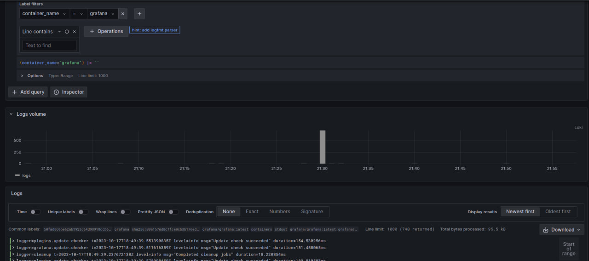
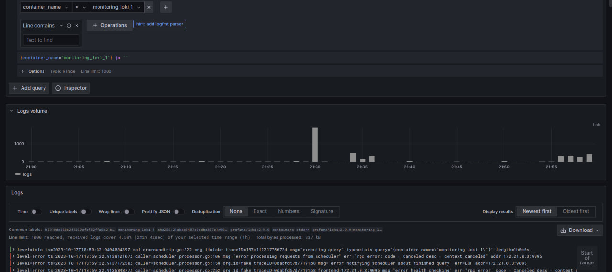
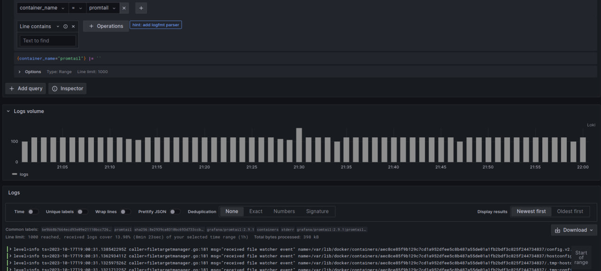
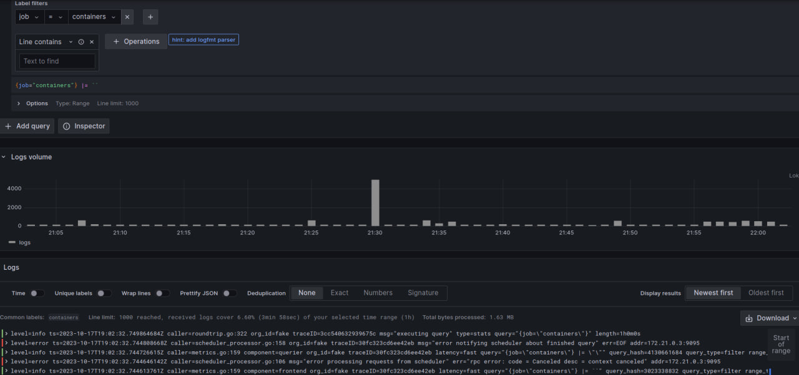

# Logging stack

--------------------------------
## Graphana
- Access logs via UI, very user-friendly interface, cooperate with Loki for good,
it can connect to different sources of data, connect data via multithreading and visualizing them.
This helps to build complex monitoring panels

## Promtail
- Promtail is good for mapping logs, it looks on given sources and bring it in logging stack,
it uses same service discovering mechanism as prometheus, it discovers application emitting log lines that we need to monitor 
## Loki 
- Log aggregation image with no full-text indexing,
we use it to store compressed, unstructured logs and index metadata

# Results observation
First of all I want to present list of deployed containers

## Python application

## CPP Application 

## Grafana

## Loki

## Promtail

## All docker containers
We can select all deployed containers by selecting job as a filter,
'job' value should be 'containers'
