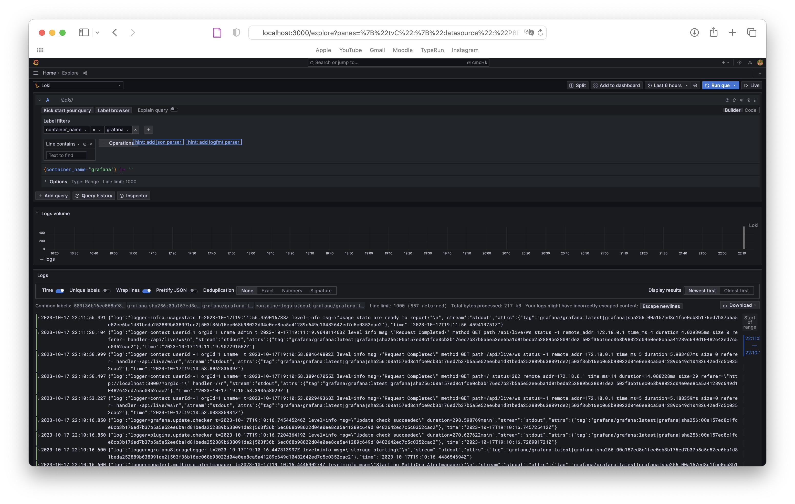
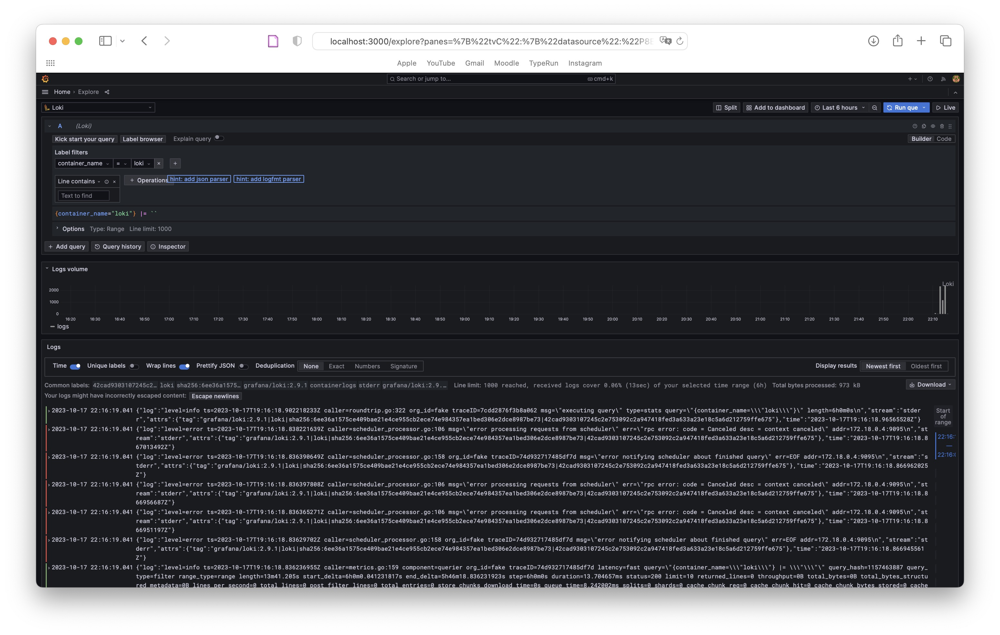
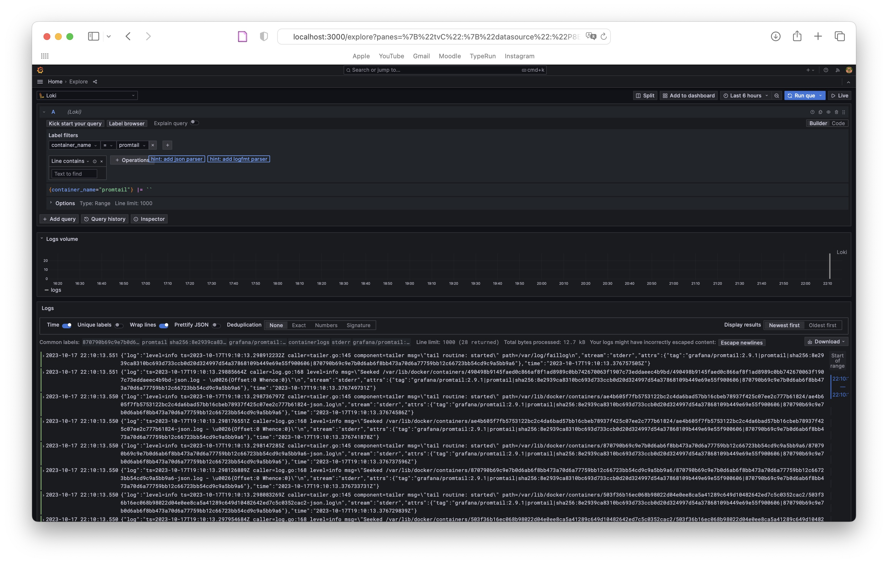
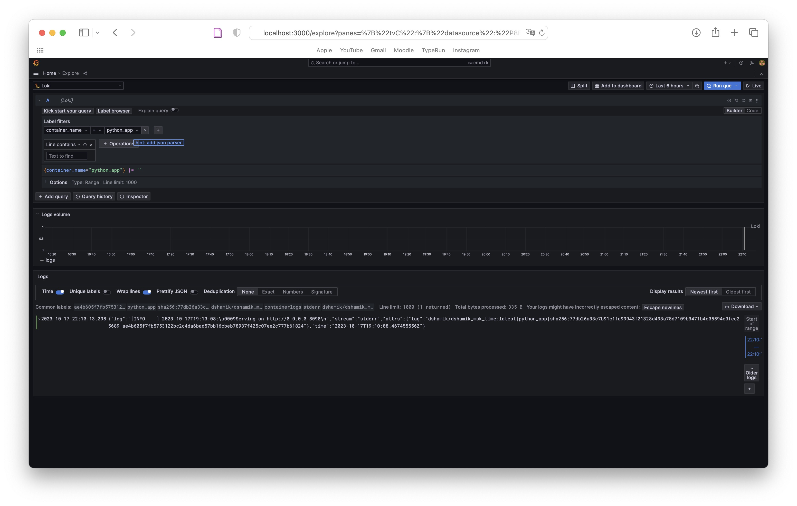

# Logging

In the logging stack **Grafana**, **Loki**, and **Promtail** work together seamlessly to provide a robust and efficient log management solution.

## Stack Overview

### Grafana

Grafana serves as the frontend visualization tool for logging system. It provides a user-friendly interface to create, explore, and share dashboards, enabling you to visually analyze and understand log data. Grafana integrates seamlessly with various data sources, including Loki, making it an ideal choice for log visualization.

### Loki

Loki acts as the central log aggregation system in logging stack. It efficiently collects, indexes, and stores log data from various sources, enabling fast and reliable access to logs. Loki is designed to handle large volumes of logs while offering powerful querying capabilities.

### Promtail

Promtail acts as the agent responsible for collecting and forwarding log data to Loki. It tailors logs from various sources, enriches them with metadata, and efficiently sends the processed data to the Loki backend. Promtail ensures that log entries are collected in real-time and organized before reaching the central log repository.

## Tags from JSON logs:

- `container_id`

- `container_name`

- `filename`

- `image_id`

- `image_name`

## Log Examples

### Grafana

### Loki

### Promtail

### Python App

