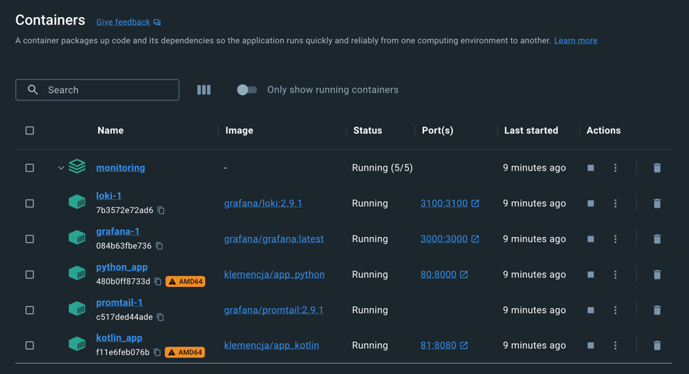
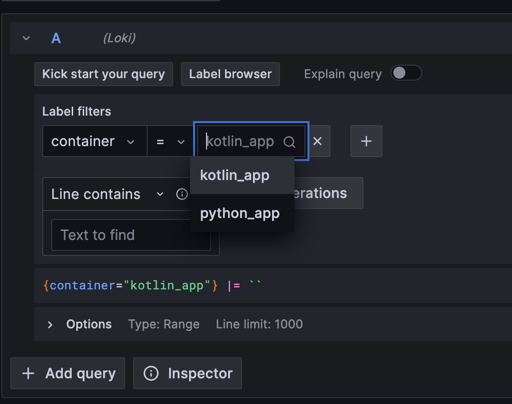
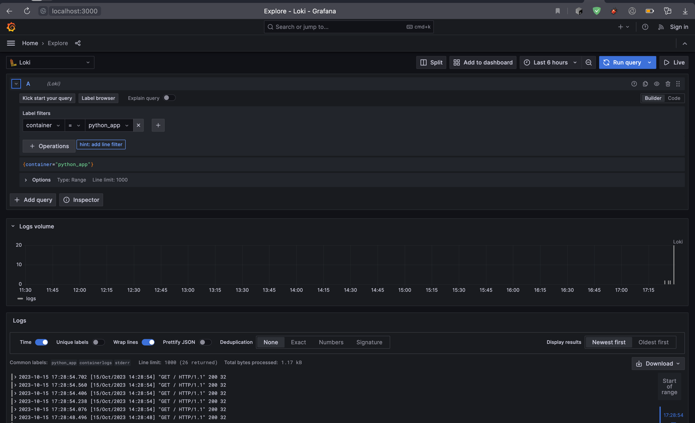
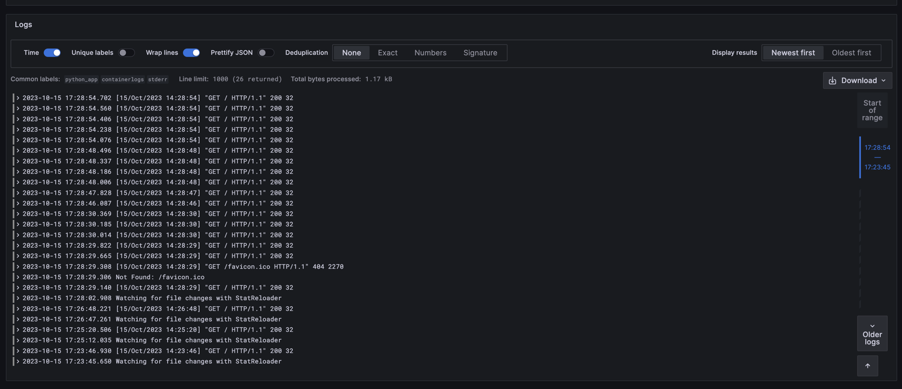
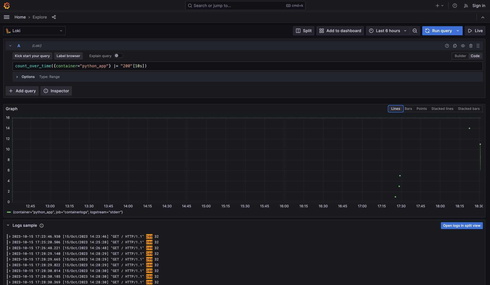
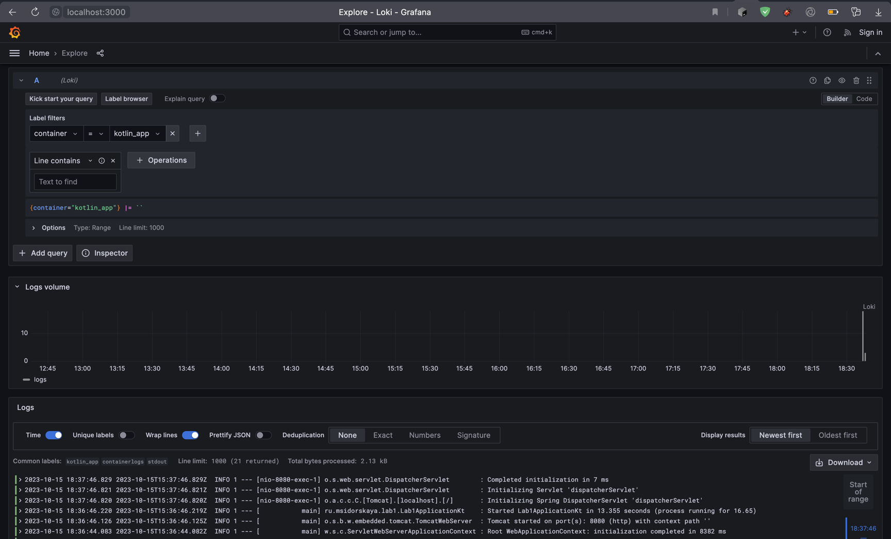
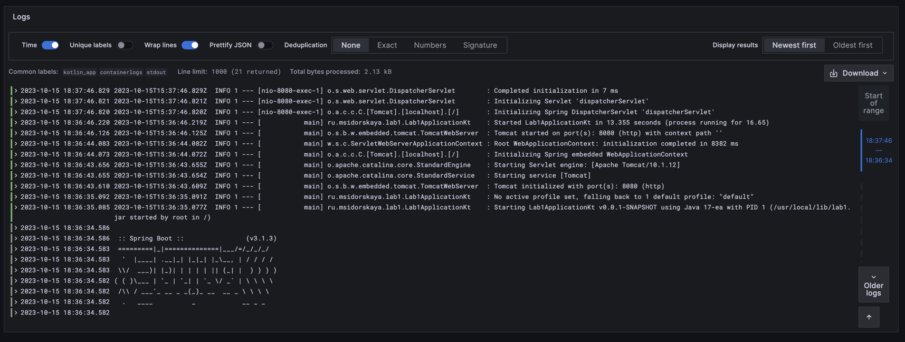

## Logging stack

My logging stack contains 3 elements (+ the application):

#### Application

`python_app` - the application itself which runs and produces logs we wish to see at the interface.

#### Grafana

The tool for visualisation data that uses `loki` as datasource in my case. It builds user's requests on LogQL language
and sends them to the `loki`. Then `grafana` takes the response and visualise it at the interface.

In my docker compose grafana has mounted volume with ready configuration file:
`./config/grafana-datasources.yml:/etc/grafana/provisioning/datasources/datasources.yaml`
This configuration file contains ready to use datasource `Loki` so that user doesn't need to add it manually.

#### Loki

The component that stores all the logs, indexes them for the fast search and provides an API for pushing data and
getting search results.

My docker compose uses the default configuration for loki. The important thing is to run it within the same network with
grafana and promtail.

#### Promtail

The tool that finds logs, parses them, adds any labels and sends to `loki` via its push-api (`/loki/api/v1/push`). In my
case promtail finds

My docker compose file for promtail mounts the volume with my custom config file (`./config/promtail.yml`). The
configuration file:

- specifies the client where to push logs (`clients.url` = loki host)
- adds filtering for logs. I don't want all the logs to reach my promtail, thats why I added filter for logging tag,
  which means that only services with tag `logging: "promtail"` could be a source for promtail.
- has relabel configurations. For example, it relabels docker's default label `__meta_docker_container_name` to much
  simpler `container`, so that now I can use simple `container = python_app` query to search logs from specific
  container.

## Screenshots

I ran my docker container via `docker compose up`:

My grafana provides a choice of container to view the logs from. I have 2 applications running and my logging stack
supports both of them at the same time:

### Python app logging

I opened my `localhost` page few times to create logs from my application.

My grafana is running on `localhost:3000` and provides for me logs of my application:

In this example I asked for all the logs from my `python_app` container and here is the result:

Also, I tried to play with LogQL and draw the graph that counts all the successful responses (with `200` code) of my
application over time. Each point aggregates data within last 10 seconds:

### Kotlin app logging

I choose `kotlin_app` for the label `container`:

As a result I can see all the logs from my Spring kotlin application:
