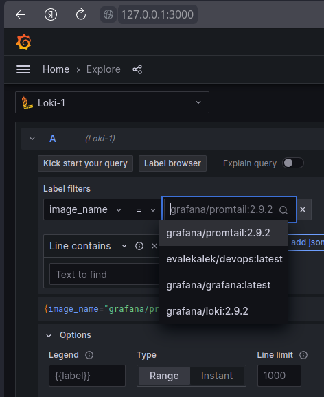
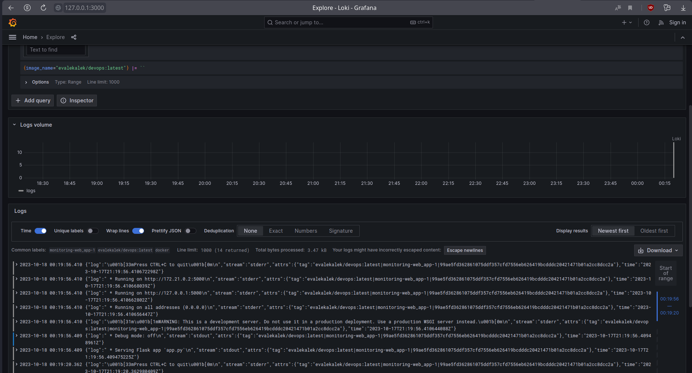

# Logging

## Grafana

The purpose of Grafana is to provide a place to check and work with logs easier. 
In our case Grafana provides a handsome UI and the ability to easily track logs (with or without queries).

The Grafana is set up with default configuration from the image.

## Loki

Loki is used to collect and access logs.

Loki is set up with default configuration from the image.

## Promtail

Promtail is used as an agent which ships the contents of local logs to a private Loki instance.

## Screenshots as example

### List of images

### Python web app logs (from Grafana)

### Promtail logs (from Grafana)

