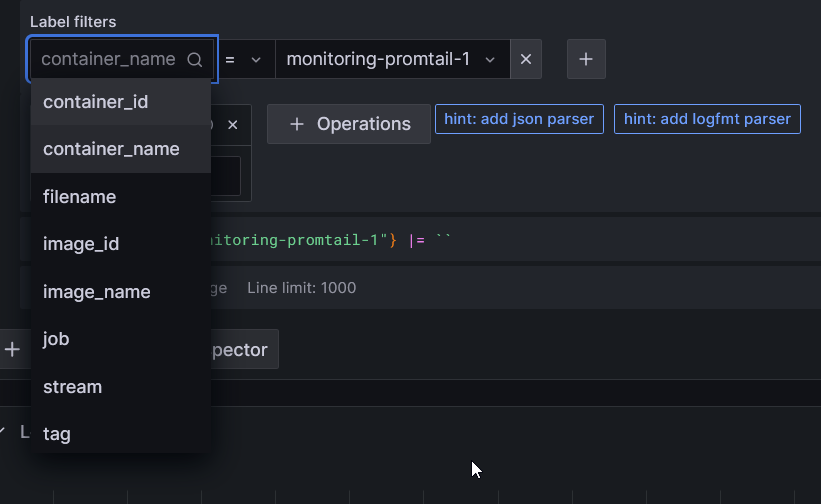
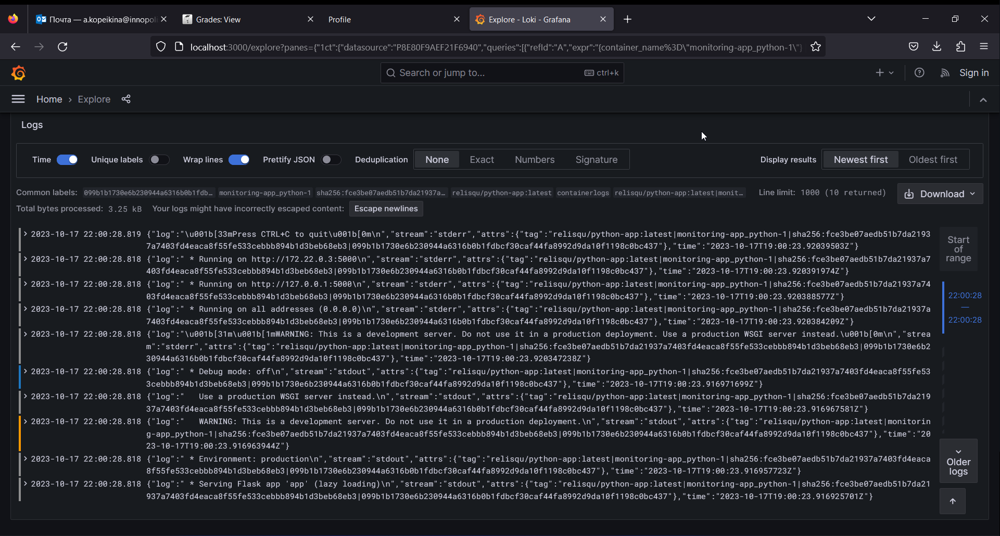
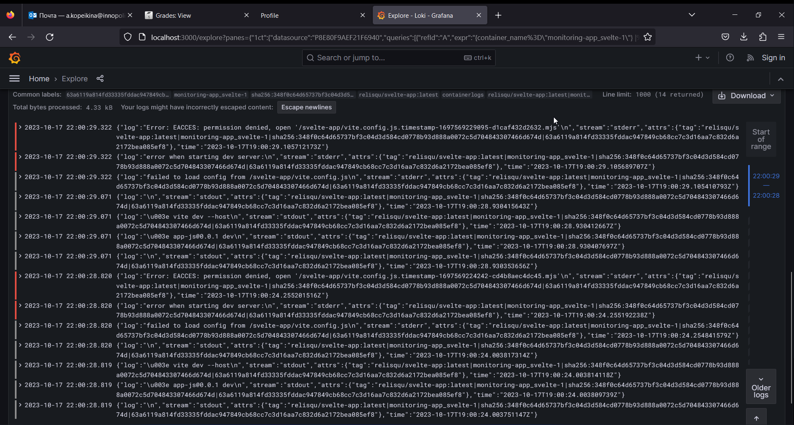

# Logging

## Stack

- We use `graphana` for logs access by GUI. It also allows to create some graphs and share them with other users.
- `Loki` is the system which collects and stores the logs. We get its config from image.
- Promtail collects and brings the logs from given sources to `Loki`.

## The result

In this solution we keep tracking of logs with the following tags:

The containers names are created automatically from yaml file.

### Promtail logs

### Python app logs

### Svelte app logs

