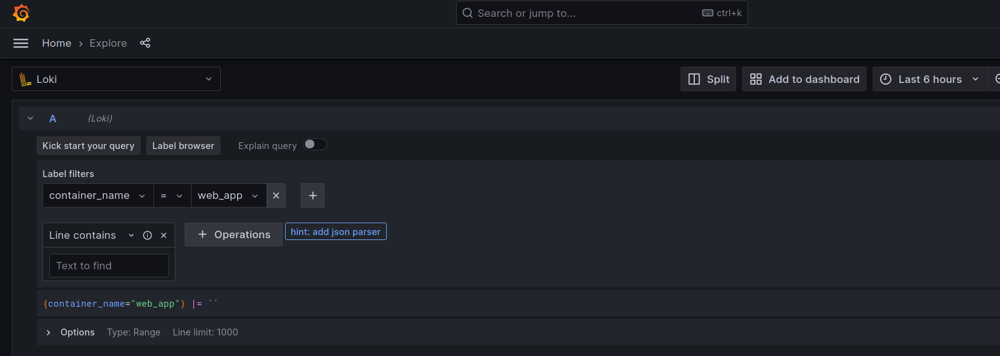
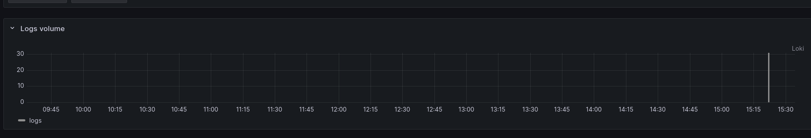
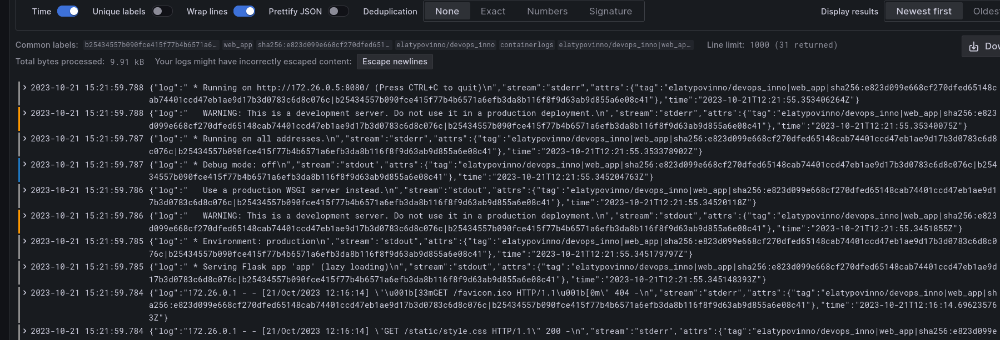

# Logging

As a logging stack **grafana**, **loki** and **promtail** were used. The role of each of them:
- **grafana**: Data visualization platform, which allows us to build dasboards and display logs in human-friendly UI.
- **loki**: Highly scalable and efficient service for storing and querying log data. It supports `LogQL` mechanism, which allows to query logs and apply different filters.
- **Promtail**: agent for `loki`, which is responsible for collecting logs from various sources (my docker image in our case). Then it sends logs to `loki` for further manipulations.

---

Here is how grafana interface looks like:

It provides convenient tool for building queries to loki to aggregate logs.

---

It also builds graph of logging intensity in timeline:

---

And of course we can examine logs themselves;
