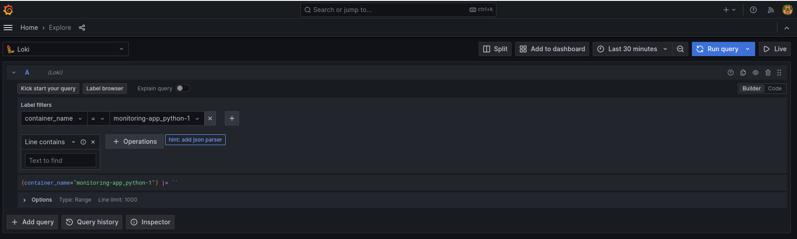
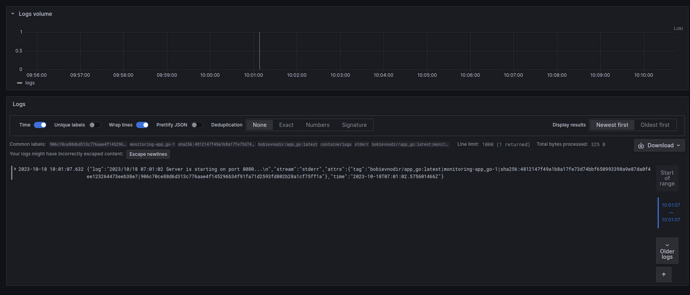

# Monitoring and Logging

## Usage

### How to run:
Change the directory to `monitoring` directory:
```
$ cd ./monitoring
$ sudo docker compose up -d
```
 
### Running Containers / Apps:
* Python flask app: http://localhost:5000
* Golang App: http://localhost:8080
* Grafana App: http://localhost:3000
* Loki App: http://localhost:3100 and http://loki:3100


## Screenshots

### Adding Queries:



### Python App:


### Golang App:




### Grafana app:

