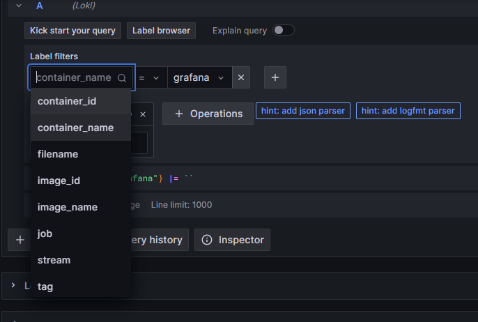
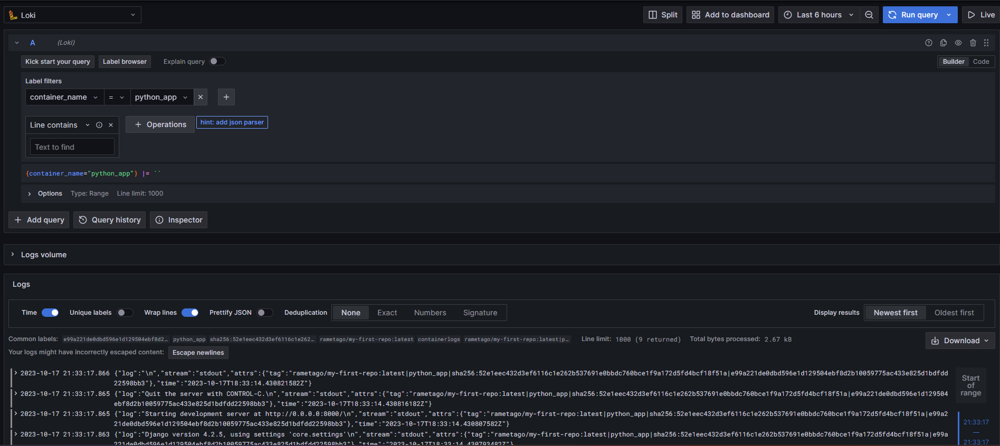
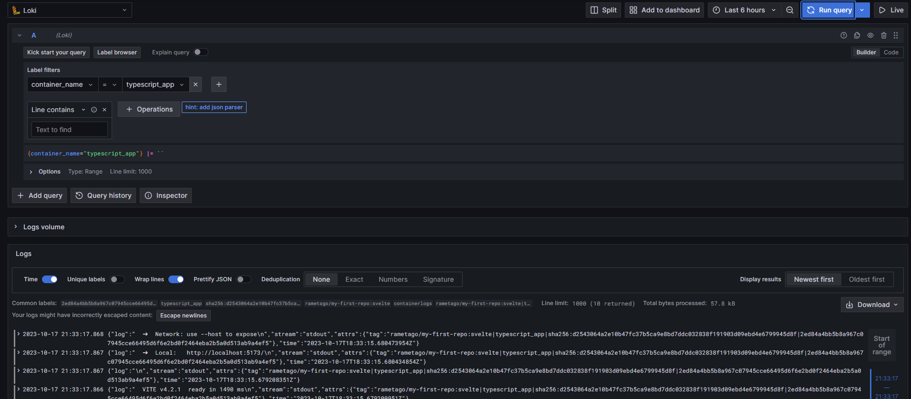
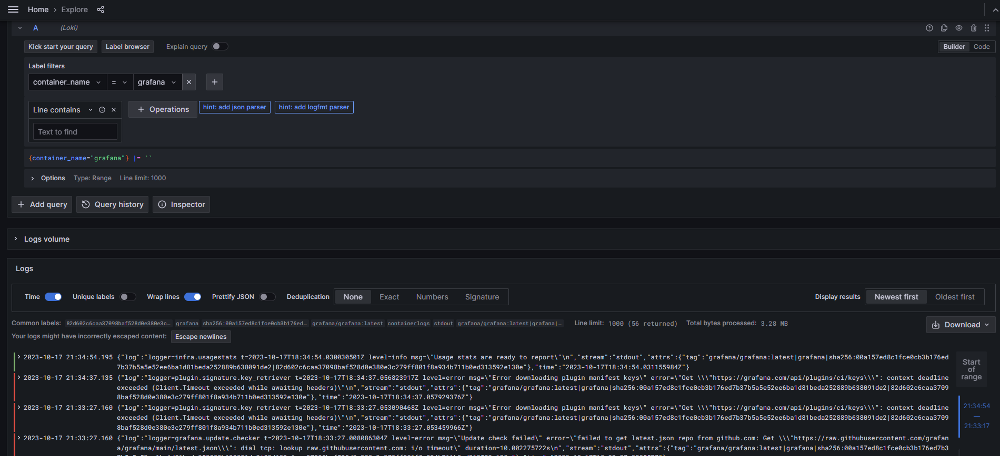

# How to run:

```
>>> cd /monitoring
>>>
>>> docker-compose run -d
```


# Running docker containers:

* Python app - http://localhost:8000
* TypeScript app - http://localhost:5173
* Grafana: For visualizing logs in UI runing on http://localhost:3000
* Loki: log aggregation system running on http://localhost:3100
but while creating datasources: http url: http://loki:3100
* Promtail: For shipping contents of logs to Loki

## Structure of logs:

```json
{
  "log": "message",
  "stream": "stream",
  "attrs": {
    "tag": "image_name|container_name|image_id|container_id"
  },
  "time": "yyyy-mm-ddThh:mm:ss.nsZ"
}
```


### Usage of tags that is created:




## Python app:



## Typescript app:



## Graffana:


