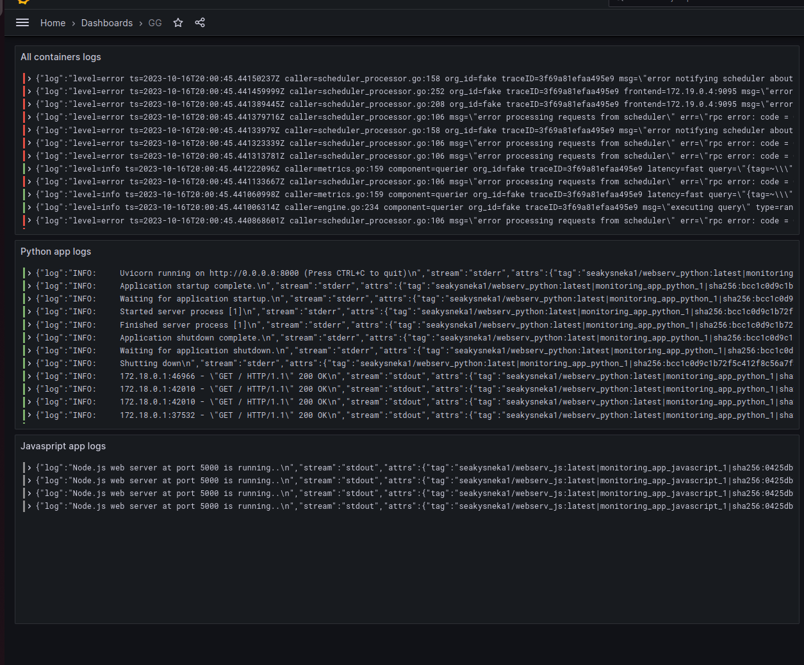

# Logging

## Grafana
Grafana is a powerful tool that provides a user-friendly interface for accessing and visualizing log data. In this particular scenario, we are utilizing Grafana with its default settings. Additionally, we have integrated Loki as a data source through Docker Compose, enabling seamless log aggregation and analysis.

## Loki
Loki is a log aggregation system that specializes in concentrating and storing logs efficiently. It is employed in this setup with its default configuration. This ensures streamlined log management and retrieval.

## Promtail
Promtail plays a vital role in collecting log data from various sources. It acts as the log collector, aggregating logs and forwarding them to Loki for centralized storage and analysis.

## Dashboard
