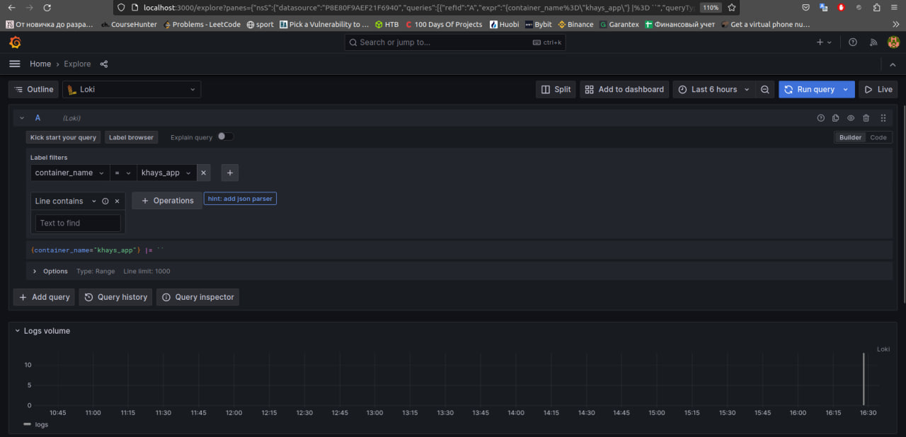
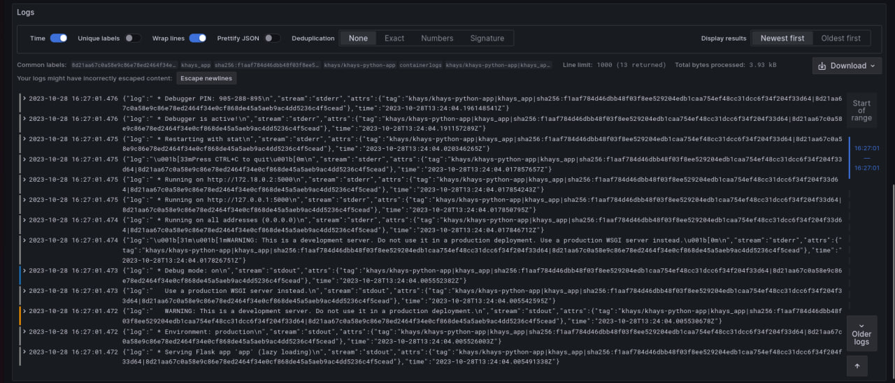
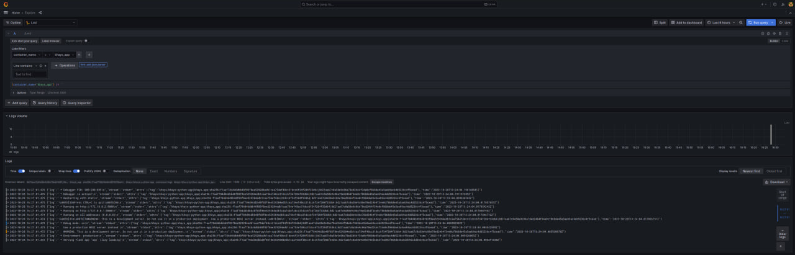

# Logging Stack Report

In this document, I will provide an overview of the logging stack that has been set up, explain the role of each component, and showcase the successful operation of the stack with screenshots.

## Logging Stack Components

### Grafana

Grafana serves as a user-friendly interface for querying and visualizing logs stored in Loki. It provides a convenient tool for building queries to Loki and aggregating logs. The following screenshot shows the Grafana interface with a graph representing logging intensity over time.

### Loki

Loki is a horizontally scalable, multi-tenant log aggregation system. It is responsible for collecting, indexing, and storing log data. In our logging stack, Loki works in conjunction with Promtail to gather and organize log information.

### Promtail

Promtail is the agent responsible for tailing log files and sending them to Loki. It collects log streams and attaches labels to them for easy querying. It plays a crucial role in ensuring that log data is ingested into Loki efficiently.

## Screenshots

### Grafana Interface

The following screenshot showcases the Grafana interface, providing a visual representation of logging intensity over time. It demonstrates the graph and query capabilities of Grafana.

### Log Entries

In this screenshot, you can see individual log entries from the log data stored in Loki. These logs are organized and can be efficiently queried thanks to Loki's capabilities.

And logs in Prettify JSON form

### Full Logging Stack

This screenshot provides an overview of the entire logging stack, showing the Grafana interface with the logging graph and log entries together, demonstrating a fully functional logging solution.

## Conclusion

The logging stack comprising Grafana, Loki, and Promtail offers a powerful solution for log aggregation and visualization. It provides insights into application performance and helps in identifying issues through log analysis.

The combination of these components creates a versatile and scalable logging system, ensuring the effective collection and analysis of log data.
