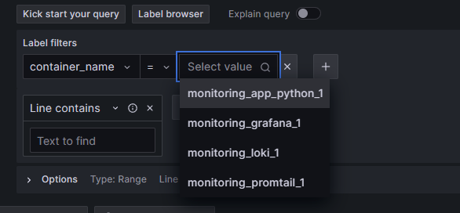
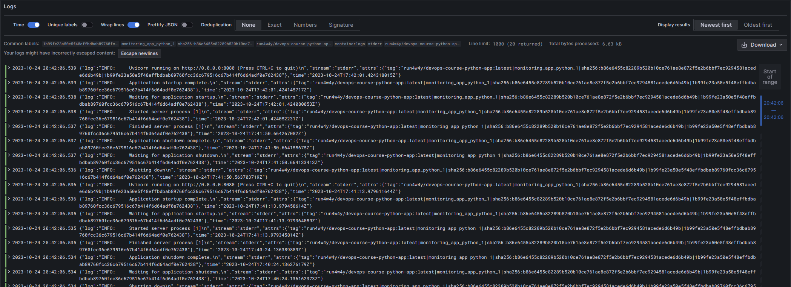
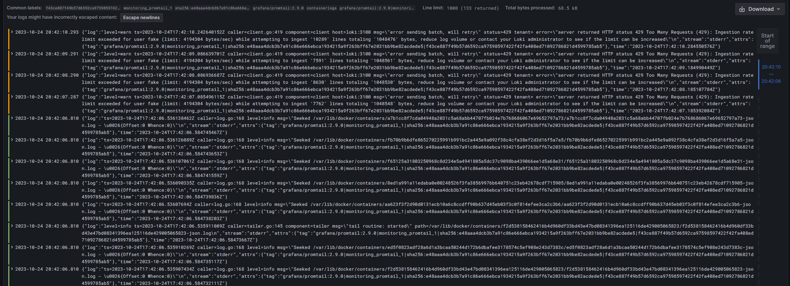

# Logging

## Grafana
Grafana is an analytics and metrics visualization web application

Here it's used with mostly default configurations, I also added a Loki datasource

## Loki
Loki is a logs aggregator application

Used with default configuration

## Promtail
A logs collector, takes logs and sends them to Loki

## Screenshots

 
