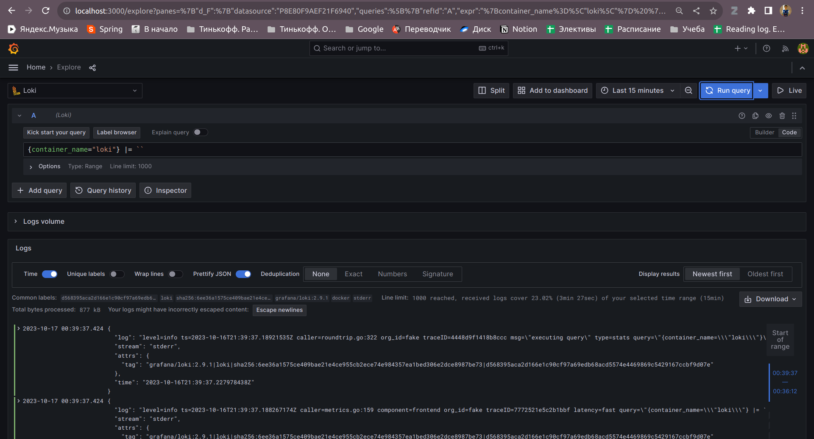
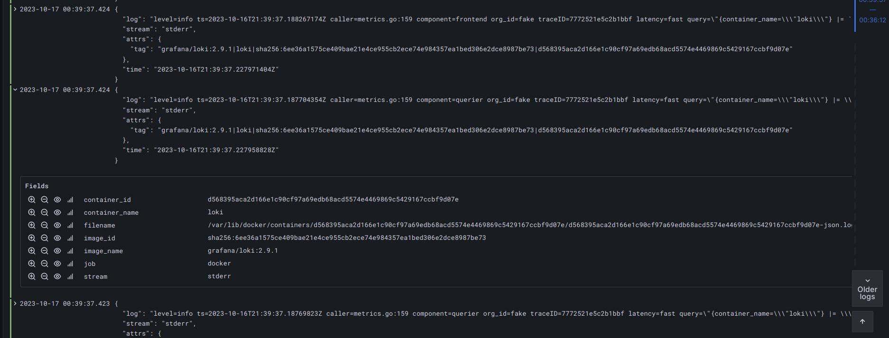
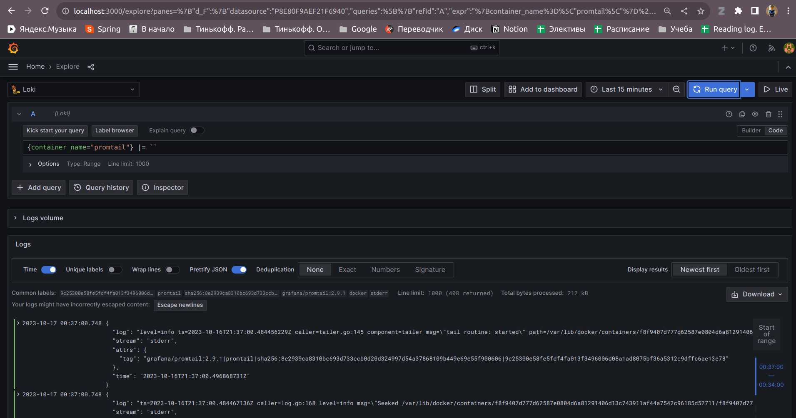
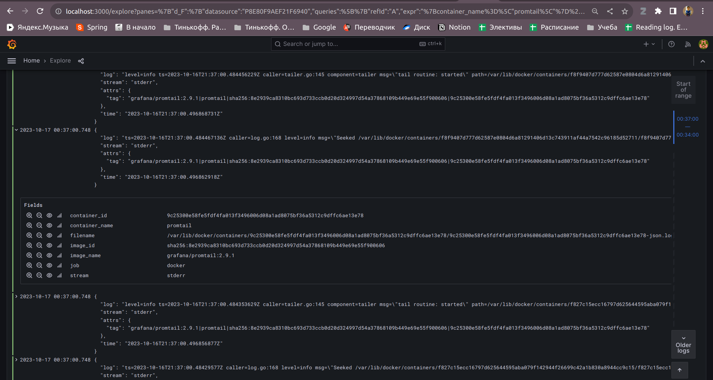
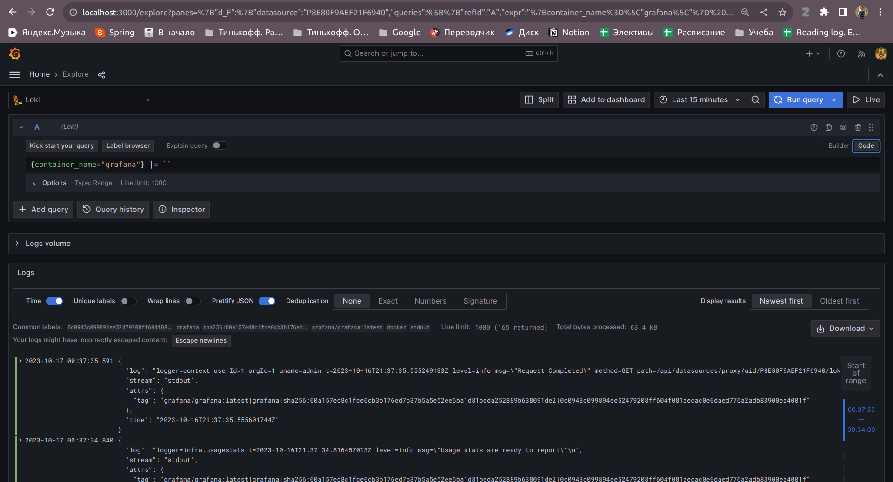
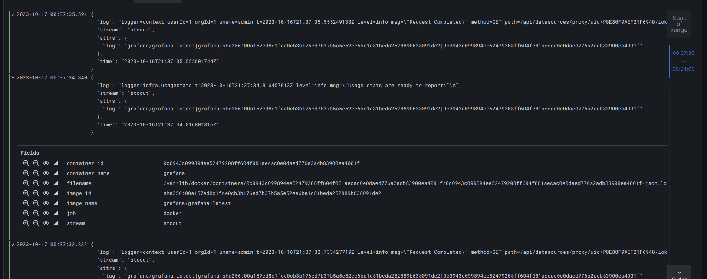

##### Logging infrastructure consists of:
 * **Promtail**

   There is an agent that retrieves logs from various sources, modifies them to the required format, and sends them to the loki datastore.

   Starts at promtail:9080 and has config in ./promtail directory

 * **Loki**

   Efficient datastore for logs. Needs to store logs from all containers and allow grafana to pull them

   Starts at loki:3100

 * **Grafana**

   Service for visualization logs and metrics

   Starts at grafana:3000 and has config for datasource in ./grafana directory

 ##### Logs comes from all previous container and also from two additional web-app: moscow-time-app, base-converter-app

 ##### Best practices:
 * Reuse logging config in docker-compose file by referencing
 * Use max-size to prevent memory overflow due to endless logs
 * Name network for convenient use multiple containers

 #### Pictures:
 Loki container:
 
 

 Promtail container:
 
 

 Grafana container:
 
 