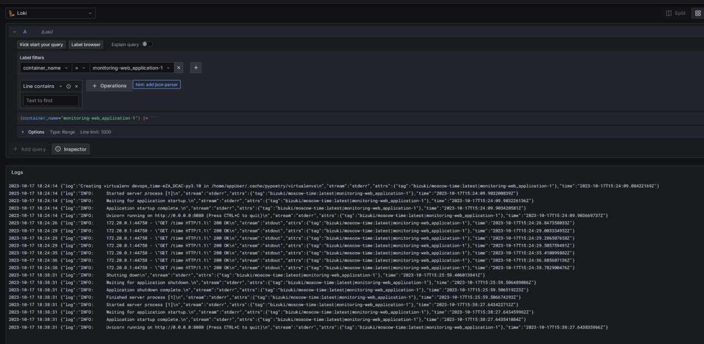

# Monitoring

## Components
### Moscow time
Application which shows time in MSK. The main target of monitoring.
In order to collect logs and only neccessary information we specifed custom logger for this app.
```docker
logging:
    driver: "json-file"
    options:
    tag: "{{.ImageName}}|{{.Name}}"
```
Here we collect info about container into tag

### Promtail
Actor which collects logs from application and then send it to loki. The config is taken from official promtail config [example](https://github.com/black-rosary/loki-nginx/blob/master/promtail/promtail.yml).

### Loki
Stores logs from promtail and gives them by query to graphana. Config is the same as graphana + loki [example](https://github.com/grafana/loki/blob/main/production/docker-compose.yaml).

### Graphana
Web-UI which shows logs of application by quering Loki. 

Here you can see the logs of python application.
