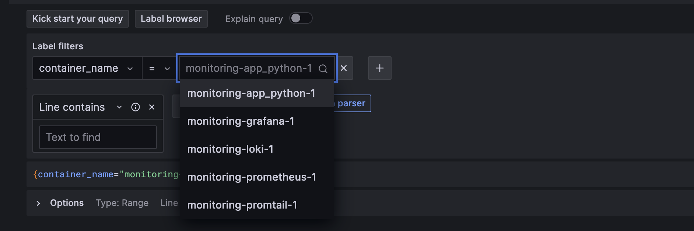
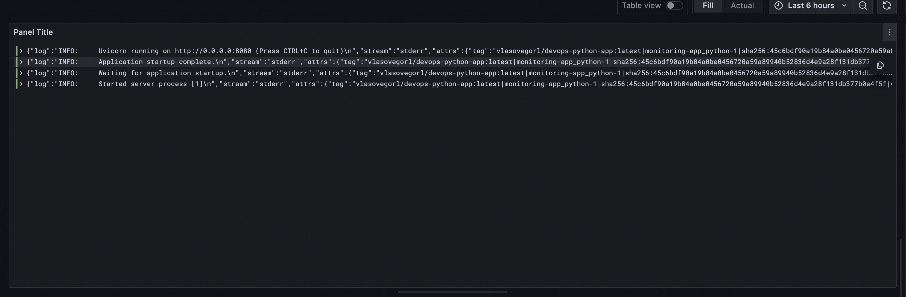

# LOGGING
## Grafana
Utilised to access the log through a pretty UI.

In this instance, graphana is used with the default settings. Loki's datasource from compose is added.

## Loki
Logs aggregator, used with the default settings

## Promtail
Logs collector, provides logs for Loki

## Screenshots

