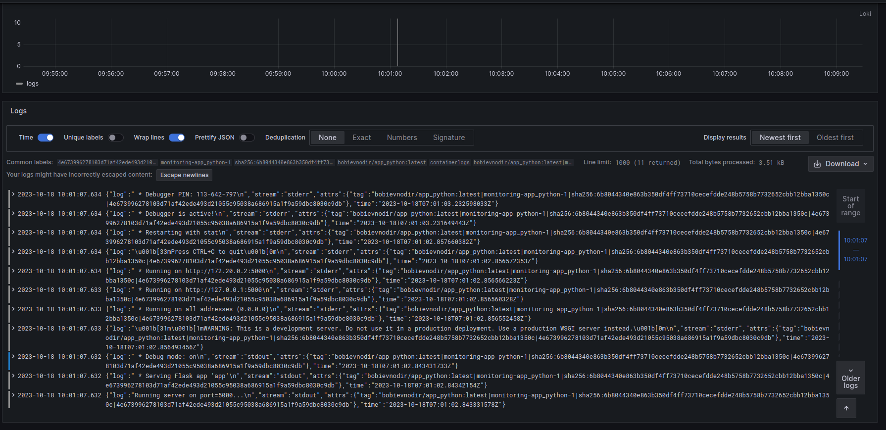
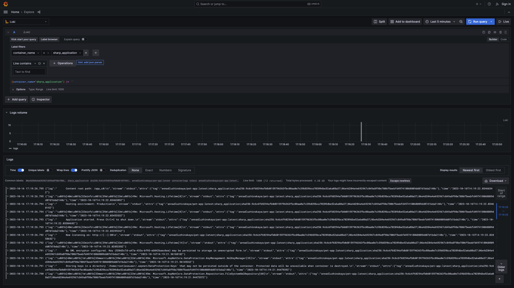
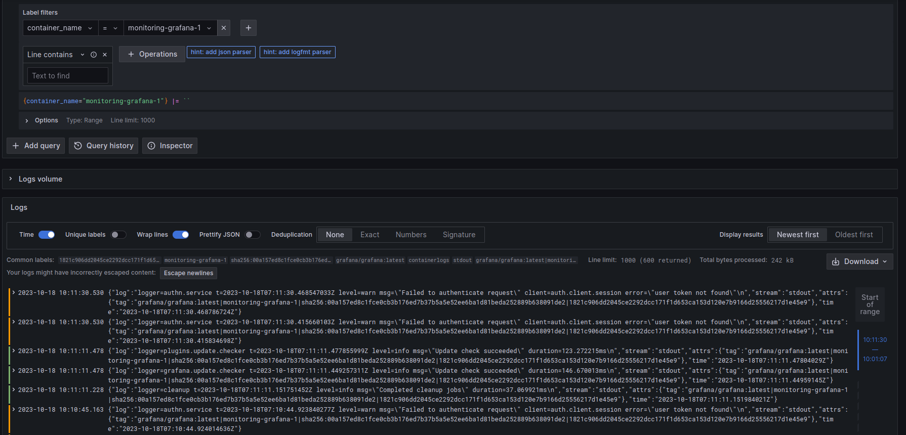
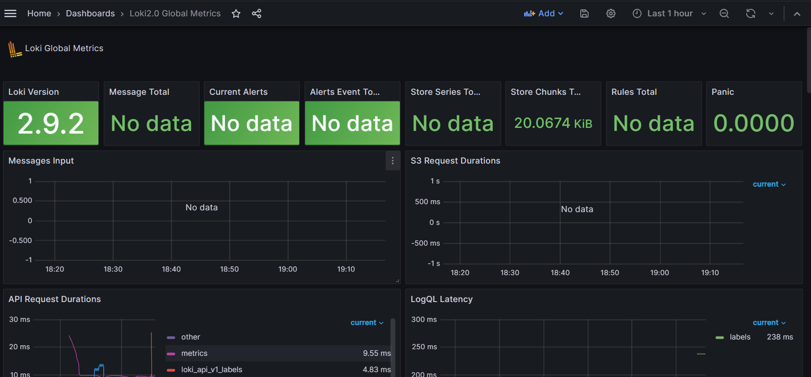
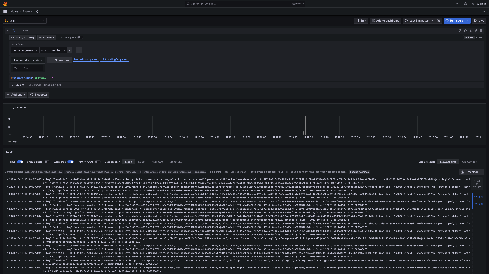

# Logging

## Stack

- *Grafana* is an open-source data visualization platform that allows users to create and share interactive dashboards and graphs. It supports various data sources and provides powerful querying and alerting capabilities.
- *Loki* is a horizontally scalable multi-tenant log aggregation system built by Grafana Labs. It efficiently collects, indexes, and stores logs from various sources, enabling easy analysis and troubleshooting.
- *Promtail* is the agent responsible for collecting and forwarding logs from different services and systems to Loki. It is designed to be lightweight, easy to configure, and capable of enriching log entries with additional metadata before forwarding them.

## Log format

{ "log": some string message,
  "stream": stream,
  "attrs": {
    "tag": string in such format "image_name|container_name|image_id|container_id"
  },
  "time": date and time in sch format "yyyy-mm-ddThh:mm:ss.nsZ"
}

## Screenshots

### Logs

- Python App

- C# App

- Grafana

- Loki

- Promtail

