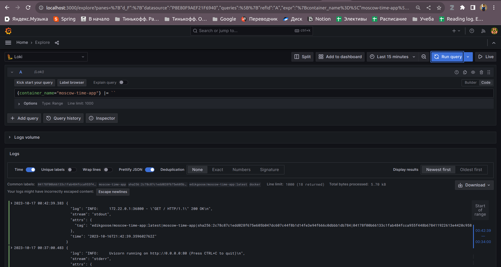
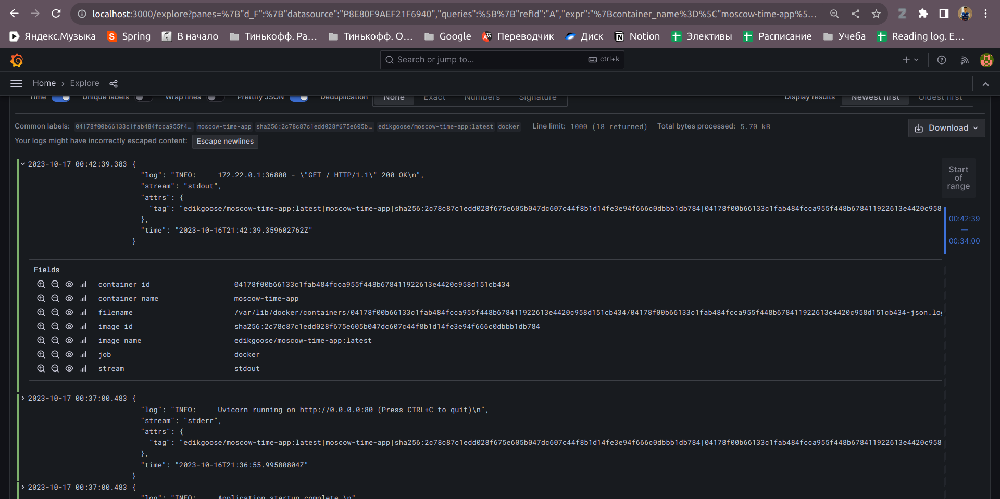
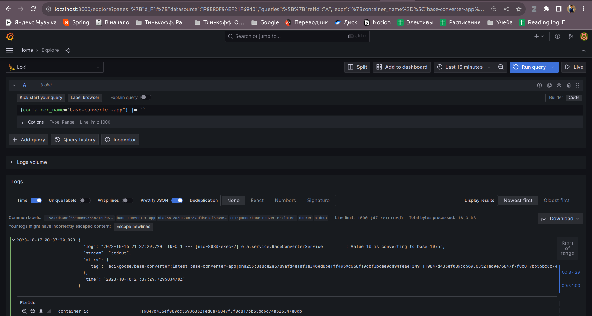
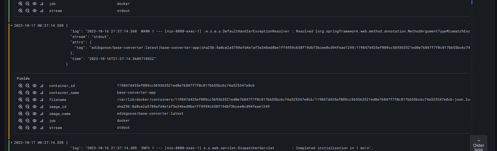

##### Logging infrastructure consists of:
* **Promtail**
    
  Agent that takes logs from different sources, refactor it to needed format
  and push them to the loki datastore
  
  Starts at promtail:9080 and has config in ./promtail directory

* **Loki**

  Efficient datastore for logs. Needs to store logs from all containers and
  allow grafana to pull them
  
  Starts at loki:3100

* **Grafana**

  Service for visualization logs (or metrics)
    
  Starts at grafana:3000 and has config for datasource in ./grafana directory

##### Logs comes from all previous container and also from two additional web-app: moscow-time-app, base-converter-app

##### Some best practices:
* Reuse logging config in docker-compose file by referencing (*)
* Use max-size to prevent memory overflow due to endless logs
* Name network for convenient use multiple containers

#### Useful resources:
* https://habr.com/ru/companies/badoo/articles/507718/
* https://github.com/black-rosary/loki-nginx/blob/master/promtail/promtail.yml - promtail config
* https://github.com/grafana/loki/blob/main/production/docker-compose.yaml - docker-compose config

#### Pictures:
Python container:

Kotlin container:

Loki container:

Promtail container:

Grafana container:

