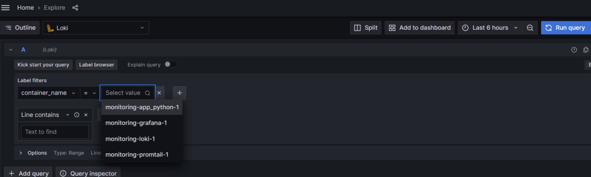
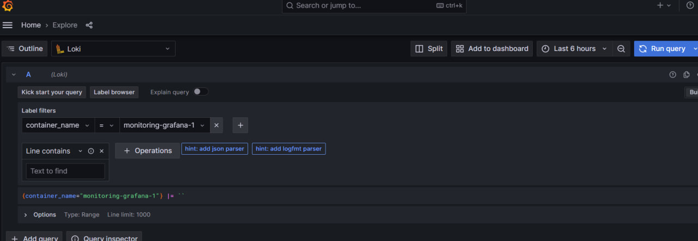
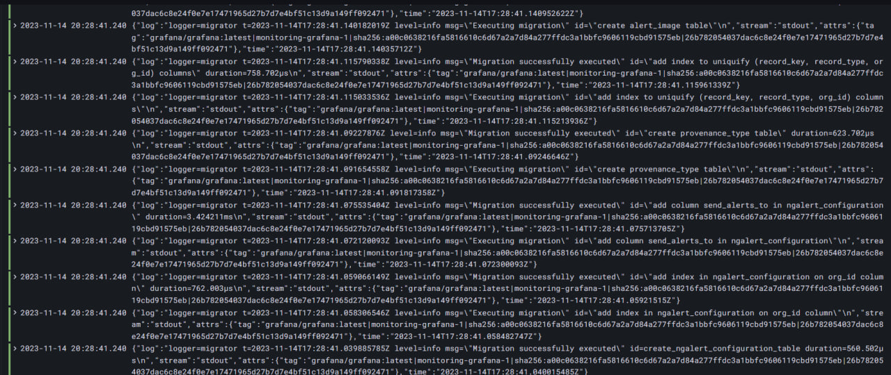
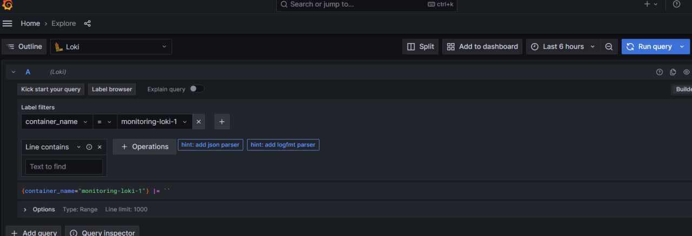
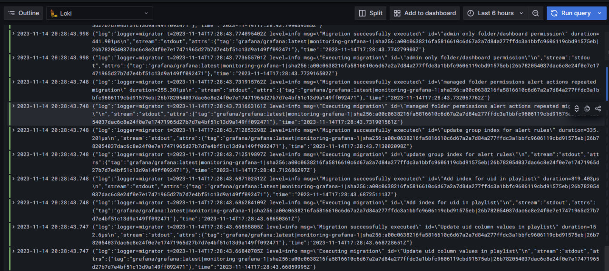
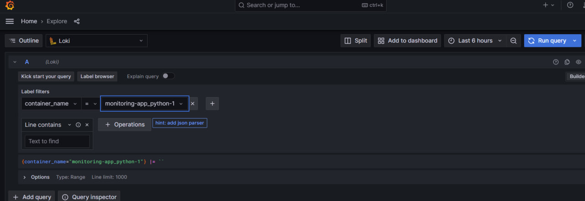
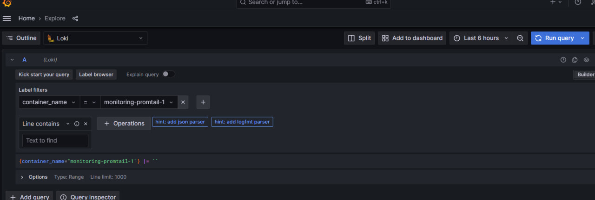
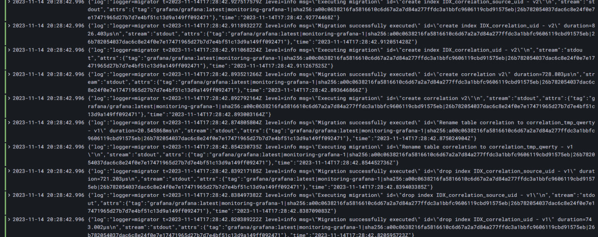

# Monitoring and Logging

## Loki

`loki:3100` - Loki start point.

Loki is a log aggregation system that stores and queries logs from all of your apps and infrastructure. 
Grafana Loki is a collection of components that may be used to provide a fully functional logging stack. 
Loki, unlike other logging systems, is designed to solely index metadata about your logs. 
The log data is then compressed and chunked in object storage. 
Loki's functioning is simplified and greatly reduced by a short index and highly compressed pieces. 

## Promtail

`promtail:9080` - Promtail start point.

Config file for Promtail saved in `promtail` directory.

Promtail is a service that sends the contents of local logs to a Grafana Loki instance or Grafana Cloud. 
Promtail is often installed on every system that runs programs that must be monitored. 
Promtail is required to gather and transport log data from several sources to a centralized log aggregation system. 
Promtail supports log streaming, parsing, filtering, and interaction with log storage systems such as Loki in real time.

## Grafana

`grafana:3000` - Grafana start point.

Grafana is a free and open source visualization and analytics tool. 
Grafana enables you to query, display, alert on, and examine metrics, logs, and traces stored anywhere. 
Grafana includes tools for transforming time-series database data into informative graphs and visualizations.

## Best practices

1. Clear network specification.

2. Promtail config file creation according to standarts.

3. Loki specification in terms of data source configuration.

# Screenshots

## Containers

## Grafana

## Loki

## Python app

## Promtail

