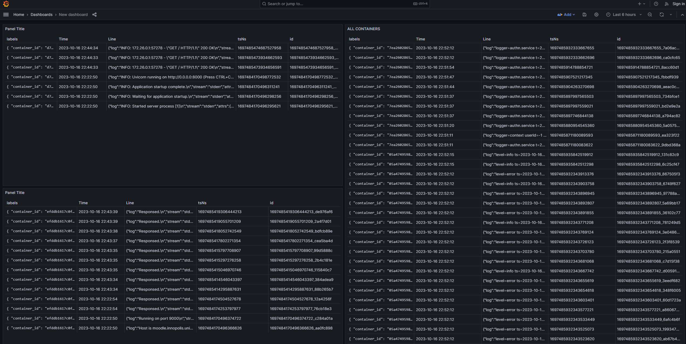

# Grafana
Visualization and monitoring platform.
Provides customizable dashboards for log data visualization, supports various data sources, including Loki.

# Loki
Log aggregation and storage system.
Collects, indexes, and efficiently stores log data, designed for scalability.

# Promtail
Log scraper and forwarder.
Scapes log files, attaches metadata labels, and transforms log entries for Loki.

# Result
