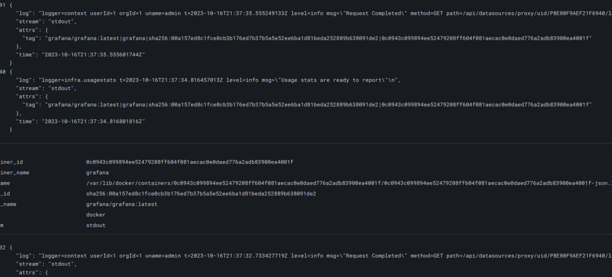
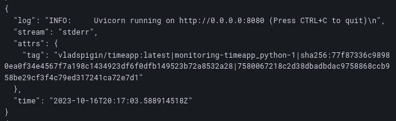

# Logging

- Loki is log aggregation system.
- Grafana is needed to visualize logs in GUI with flexible configuration of aggregations and visualizing methods.
- Promtail is an agent which ships the contents of local logs to Loki.

### grafana logs

### python app logs
