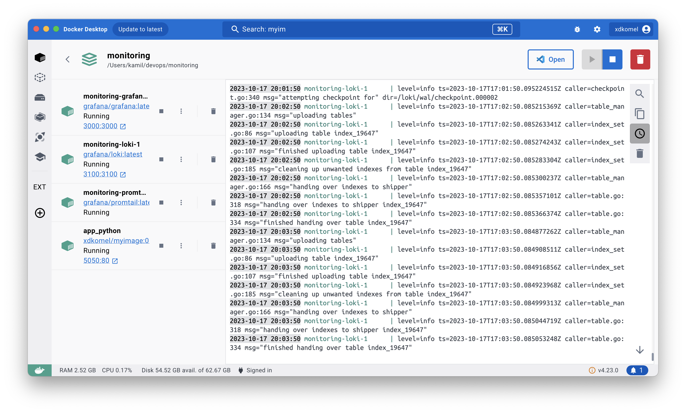

# Logging Overview
### Logging Stack Components:
- **Loki** is an efficient log aggregation system tailored to store and query logs from various applications and infrastructure sources. It operates on the default configuration and starts at `loki:3100`.

- **Promtail** serves as an agent responsible for shipping logs from diverse sources to the Grafana Loki instance. Configuration is set up from the promtail directory, and it begins at `promtail:9080`.

- **Grafana** is a versatile software enabling querying, visualization, and exploration of metrics and logs. It operates with default options and utilizes the datasource configuration specified in docker-compose. Grafana initiates at `grafana:3000`.



### Promtails Logs
```
2023-10-17 19:46:50 level=info ts=2023-10-17T16:46:50.323617254Z caller=promtail.go:133 msg="Reloading configuration file" md5sum=525c12d180459c0b237319ec98a18d4f
2023-10-17 19:46:50 level=info ts=2023-10-17T16:46:50.325250964Z caller=server.go:334 http=[::]:9080 grpc=[::]:46317 msg="server listening on addresses"
2023-10-17 19:46:50 level=info ts=2023-10-17T16:46:50.325691163Z caller=main.go:174 msg="Starting Promtail" version="(version=2.8.6, branch=HEAD, revision=990ac685e)"
2023-10-17 19:46:50 level=warn ts=2023-10-17T16:46:50.325941341Z caller=promtail.go:265 msg="enable watchConfig"
2023-10-17 19:46:55 level=info ts=2023-10-17T16:46:55.324738351Z caller=filetargetmanager.go:358 msg="Adding target" key="/var/log/*log:{job=\"varlogs\"}"
2023-10-17 19:46:55 level=info ts=2023-10-17T16:46:55.327981883Z caller=filetarget.go:285 msg="watching new directory" directory=/var/log
2023-10-17 19:46:55 ts=2023-10-17T16:46:55.328510324Z caller=log.go:168 level=info msg="Seeked /var/log/displaypolicyd.stdout.log - &{Offset:0 Whence:0}"
2023-10-17 19:46:55 level=info ts=2023-10-17T16:46:55.328545419Z caller=tailer.go:143 component=tailer msg="tail routine: started" path=/var/log/displaypolicyd.stdout.log
2023-10-17 19:46:55 level=info ts=2023-10-17T16:46:55.328989075Z caller=tailer.go:143 component=tailer msg="tail routine: started" path=/var/log/fsck_apfs.log
2023-10-17 19:46:55 ts=2023-10-17T16:46:55.329014203Z caller=log.go:168 level=info msg="Seeked /var/log/fsck_apfs.log - &{Offset:0 Whence:0}"
2023-10-17 19:46:55 ts=2023-10-17T16:46:55.329354752Z caller=log.go:168 level=info msg="Seeked /var/log/fsck_apfs_error.log - &{Offset:0 Whence:0}"
2023-10-17 19:46:55 level=info ts=2023-10-17T16:46:55.329378832Z caller=tailer.go:143 component=tailer msg="tail routine: started" path=/var/log/fsck_apfs_error.log
2023-10-17 19:46:55 ts=2023-10-17T16:46:55.329610215Z caller=log.go:168 level=info msg="Seeked /var/log/fsck_hfs.log - &{Offset:0 Whence:0}"
2023-10-17 19:46:55 level=info ts=2023-10-17T16:46:55.329601587Z caller=tailer.go:143 component=tailer msg="tail routine: started" path=/var/log/fsck_hfs.log
2023-10-17 19:46:55 ts=2023-10-17T16:46:55.334928697Z caller=log.go:168 level=info msg="Seeked /var/log/install.log - &{Offset:0 Whence:0}"
2023-10-17 19:46:55 level=info ts=2023-10-17T16:46:55.334971891Z caller=tailer.go:143 component=tailer msg="tail routine: started" path=/var/log/install.log
2023-10-17 19:46:55 ts=2023-10-17T16:46:55.33530815Z caller=log.go:168 level=info msg="Seeked /var/log/jreinstall.log - &{Offset:0 Whence:0}"
2023-10-17 19:46:55 level=info ts=2023-10-17T16:46:55.335467457Z caller=tailer.go:143 component=tailer msg="tail routine: started" path=/var/log/jreinstall.log
2023-10-17 19:46:55 ts=2023-10-17T16:46:55.335823541Z caller=log.go:168 level=info msg="Seeked /var/log/shutdown_monitor.log - &{Offset:0 Whence:0}"
2023-10-17 19:46:55 level=info ts=2023-10-17T16:46:55.335913952Z caller=tailer.go:143 component=tailer msg="tail routine: started" path=/var/log/shutdown_monitor.log
2023-10-17 19:46:55 ts=2023-10-17T16:46:55.336803123Z caller=log.go:168 level=info msg="Seeked /var/log/system.log - &{Offset:0 Whence:0}"
2023-10-17 19:46:55 level=info ts=2023-10-17T16:46:55.336928316Z caller=tailer.go:143 component=tailer msg="tail routine: started" path=/var/log/system.log
2023-10-17 19:46:55 level=info ts=2023-10-17T16:46:55.337059741Z caller=tailer.go:143 component=tailer msg="tail routine: started" path=/var/log/wifi.log
2023-10-17 19:46:55 ts=2023-10-17T16:46:55.337059132Z caller=log.go:168 level=info msg="Seeked /var/log/wifi.log - &{Offset:0 Whence:0}"
2023-10-17 19:46:56 level=warn ts=2023-10-17T16:46:56.110459009Z caller=client.go:419 component=client host=loki:3100 msg="error sending batch, will retry" status=429 tenant= error="server returned HTTP status 429 Too Many Requests (429): Ingestion rate limit exceeded for user fake (limit: 4194304 bytes/sec) while attempting to ingest '6310' lines totaling '1048550' bytes, reduce log volume or contact your Loki administrator to see if the limit can be increased"
2023-10-17 19:46:57 level=warn ts=2023-10-17T16:46:57.402202671Z caller=client.go:419 component=client host=loki:3100 msg="error sending batch, will retry" status=429 tenant= error="server returned HTTP status 429 Too Many Requests (429): Ingestion rate limit exceeded for user fake (limit: 4194304 bytes/sec) while attempting to ingest '3950' lines totaling '1048466' bytes, reduce log volume or contact your Loki administrator to see if the limit can be increased"
2023-10-17 19:46:58 level=warn ts=2023-10-17T16:46:58.176576423Z caller=client.go:419 component=client host=loki:3100 msg="error sending batch, will retry" status=429 tenant= error="server returned HTTP status 429 Too Many Requests (429): Ingestion rate limit exceeded for user fake (limit: 4194304 bytes/sec) while attempting to ingest '5376' lines totaling '1044208' bytes, reduce log volume or contact your Loki administrator to see if the limit can be increased"
2023-10-17 19:46:59 level=warn ts=2023-10-17T16:46:59.036036986Z caller=client.go:419 component=client host=loki:3100 msg="error sending batch, will retry" status=429 tenant= error="server returned HTTP status 429 Too Many Requests (429): Ingestion rate limit exceeded for user fake (limit: 4194304 bytes/sec) while attempting to ingest '4050' lines totaling '1048453' bytes, reduce log volume or contact your Loki administrator to see if the limit can be increased"
2023-10-17 19:47:00 level=warn ts=2023-10-17T16:47:00.069709791Z caller=client.go:419 component=client host=loki:3100 msg="error sending batch, will retry" status=429 tenant= error="server returned HTTP status 429 Too Many Requests (429): Ingestion rate limit exceeded for user fake (limit: 4194304 bytes/sec) while attempting to ingest '5635' lines totaling '1048244' bytes, reduce log volume or contact your Loki administrator to see if the limit can be increased"
2023-10-17 19:47:01 level=warn ts=2023-10-17T16:47:01.102930128Z caller=client.go:419 component=client host=loki:3100 msg="error sending batch, will retry" status=429 tenant= error="server returned HTTP status 429 Too Many Requests (429): Ingestion rate limit exceeded for user fake (limit: 4194304 bytes/sec) while attempting to ingest '5482' lines totaling '1048108' bytes, reduce log volume or contact your Loki administrator to see if the limit can be increased"
2023-10-17 19:47:02 level=warn ts=2023-10-17T16:47:01.920674529Z caller=client.go:419 component=client host=loki:3100 msg="error sending batch, will retry" status=429 tenant= error="server returned HTTP status 429 Too Many Requests (429): Ingestion rate limit exceeded for user fake (limit: 4194304 bytes/sec) while attempting to ingest '5992' lines totaling '1048567' bytes, reduce log volume or contact your Loki administrator to see if the limit can be increased"
2023-10-17 19:47:03 level=warn ts=2023-10-17T16:47:03.318721233Z caller=client.go:419 component=client host=loki:3100 msg="error sending batch, will retry" status=429 tenant= error="server returned HTTP status 429 Too Many Requests (429): Ingestion rate limit exceeded for user fake (limit: 4194304 bytes/sec) while attempting to ingest '7793' lines totaling '1048524' bytes, reduce log volume or contact your Loki administrator to see if the limit can be increased"
2023-10-17 19:49:02 level=info ts=2023-10-17T16:49:02.682299261Z caller=promtail.go:133 msg="Reloading configuration file" md5sum=525c12d180459c0b237319ec98a18d4f
2023-10-17 19:49:02 level=info ts=2023-10-17T16:49:02.683775151Z caller=server.go:334 http=[::]:9080 grpc=[::]:36639 msg="server listening on addresses"
2023-10-17 19:49:02 level=info ts=2023-10-17T16:49:02.683983261Z caller=main.go:174 msg="Starting Promtail" version="(version=2.8.6, branch=HEAD, revision=990ac685e)"
2023-10-17 19:49:02 level=warn ts=2023-10-17T16:49:02.684184739Z caller=promtail.go:265 msg="enable watchConfig"
2023-10-17 19:49:07 level=info ts=2023-10-17T16:49:07.685516015Z caller=filetargetmanager.go:358 msg="Adding target" key="/var/log/*log:{job=\"varlogs\"}"
2023-10-17 19:49:07 level=info ts=2023-10-17T16:49:07.689209197Z caller=filetarget.go:285 msg="watching new directory" directory=/var/log
2023-10-17 19:49:07 level=info ts=2023-10-17T16:49:07.689804261Z caller=tailer.go:143 component=tailer msg="tail routine: started" path=/var/log/displaypolicyd.stdout.log
2023-10-17 19:49:07 ts=2023-10-17T16:49:07.689942368Z caller=log.go:168 level=info msg="Seeked /var/log/displaypolicyd.stdout.log - &{Offset:0 Whence:0}"
2023-10-17 19:49:07 ts=2023-10-17T16:49:07.690152977Z caller=log.go:168 level=info msg="Seeked /var/log/fsck_apfs.log - &{Offset:40942 Whence:0}"
2023-10-17 19:49:07 level=info ts=2023-10-17T16:49:07.690327272Z caller=tailer.go:143 component=tailer msg="tail routine: started" path=/var/log/fsck_apfs.log
2023-10-17 19:49:07 ts=2023-10-17T16:49:07.690724918Z caller=log.go:168 level=info msg="Seeked /var/log/fsck_apfs_error.log - &{Offset:338 Whence:0}"
2023-10-17 19:49:07 ts=2023-10-17T16:49:07.690845649Z caller=log.go:168 level=info msg="Seeked /var/log/fsck_hfs.log - &{Offset:20120 Whence:0}"
2023-10-17 19:49:07 level=info ts=2023-10-17T16:49:07.690883947Z caller=tailer.go:143 component=tailer msg="tail routine: started" path=/var/log/fsck_apfs_error.log
2023-10-17 19:49:07 level=info ts=2023-10-17T16:49:07.690907984Z caller=tailer.go:143 component=tailer msg="tail routine: started" path=/var/log/fsck_hfs.log
2023-10-17 19:49:07 ts=2023-10-17T16:49:07.69571552Z caller=log.go:168 level=info msg="Seeked /var/log/install.log - &{Offset:40308976 Whence:0}"
2023-10-17 19:49:07 level=info ts=2023-10-17T16:49:07.695791783Z caller=tailer.go:143 component=tailer msg="tail routine: started" path=/var/log/install.log
2023-10-17 19:49:07 ts=2023-10-17T16:49:07.696081335Z caller=log.go:168 level=info msg="Seeked /var/log/jreinstall.log - &{Offset:120 Whence:0}"
2023-10-17 19:49:07 level=info ts=2023-10-17T16:49:07.696081865Z caller=tailer.go:143 component=tailer msg="tail routine: started" path=/var/log/jreinstall.log
2023-10-17 19:49:07 ts=2023-10-17T16:49:07.696333007Z caller=log.go:168 level=info msg="Seeked /var/log/shutdown_monitor.log - &{Offset:10419 Whence:0}"
2023-10-17 19:49:07 level=info ts=2023-10-17T16:49:07.696361886Z caller=tailer.go:143 component=tailer msg="tail routine: started" path=/var/log/shutdown_monitor.log
2023-10-17 19:49:07 ts=2023-10-17T16:49:07.696804017Z caller=log.go:168 level=info msg="Seeked /var/log/system.log - &{Offset:14594 Whence:0}"
2023-10-17 19:49:07 level=info ts=2023-10-17T16:49:07.696826697Z caller=tailer.go:143 component=tailer msg="tail routine: started" path=/var/log/system.log
2023-10-17 19:49:07 ts=2023-10-17T16:49:07.697214276Z caller=log.go:168 level=info msg="Seeked /var/log/wifi.log - &{Offset:19223 Whence:0}"
2023-10-17 19:49:07 level=info ts=2023-10-17T16:49:07.697215256Z caller=tailer.go:143 component=tailer msg="tail routine: started" path=/var/log/wifi.log
```

### Loki Logs
```
2023-10-17 20:00:02 level=info ts=2023-10-17T17:00:02.083822458Z caller=metrics.go:152 component=querier org_id=fake latency=fast query="sum by (level)(count_over_time({job=\"varlogs\"}[1m]))" query_hash=367838978 query_type=metric range_type=range length=29m0s start_delta=30m2.083811132s end_delta=1m2.083811321s step=1m0s duration=373.881663ms status=200 limit=1000 returned_lines=0 throughput=119MB total_bytes=44MB lines_per_second=586204 total_lines=219171 total_entries=2 store_chunks_download_time=1.226739ms queue_time=4.53945ms splits=0 shards=0 cache_chunk_req=0 cache_chunk_hit=0 cache_chunk_bytes_stored=0 cache_chunk_bytes_fetched=0 cache_chunk_download_time=0s cache_index_req=0 cache_index_hit=0 cache_index_download_time=0s cache_result_req=0 cache_result_hit=0 cache_result_download_time=0s source=logvolhist
2023-10-17 20:00:02 level=info ts=2023-10-17T17:00:02.085179845Z caller=metrics.go:152 component=frontend org_id=fake latency=fast query="sum by (level) (count_over_time({job=\"varlogs\"}[1m]))" query_hash=2471991414 query_type=metric range_type=range length=1h0m0s start_delta=1h0m0.415169409s end_delta=415.169601ms step=1m0s duration=383.94818ms status=200 limit=1000 returned_lines=0 throughput=116MB total_bytes=44MB lines_per_second=575942 total_lines=221132 total_entries=1 store_chunks_download_time=1.226739ms queue_time=153.906996ms splits=3 shards=48 cache_chunk_req=0 cache_chunk_hit=0 cache_chunk_bytes_stored=0 cache_chunk_bytes_fetched=0 cache_chunk_download_time=0s cache_index_req=0 cache_index_hit=0 cache_index_download_time=0s cache_result_req=0 cache_result_hit=0 cache_result_download_time=0s source=logvolhist
2023-10-17 20:00:50 level=info ts=2023-10-17T17:00:50.086492637Z caller=table_manager.go:166 msg="handing over indexes to shipper"
2023-10-17 20:00:50 level=info ts=2023-10-17T17:00:50.086575076Z caller=table_manager.go:134 msg="uploading tables"
2023-10-17 20:00:50 level=info ts=2023-10-17T17:00:50.086607576Z caller=table.go:318 msg="handing over indexes to shipper index_19647"
2023-10-17 20:00:50 level=info ts=2023-10-17T17:00:50.086620704Z caller=table.go:334 msg="finished handing over table index_19647"
2023-10-17 20:01:20 level=info ts=2023-10-17T17:01:20.098903147Z caller=checkpoint.go:502 msg="atomic checkpoint finished" old=/loki/wal/checkpoint.000001.tmp new=/loki/wal/checkpoint.000001
2023-10-17 20:01:20 level=info ts=2023-10-17T17:01:20.099195143Z caller=checkpoint.go:573 msg="checkpoint done" time=4m30.004372533s
2023-10-17 20:01:50 level=info ts=2023-10-17T17:01:50.086148274Z caller=table_manager.go:166 msg="handing over indexes to shipper"
2023-10-17 20:01:50 level=info ts=2023-10-17T17:01:50.086201938Z caller=table.go:318 msg="handing over indexes to shipper index_19647"
2023-10-17 20:01:50 level=info ts=2023-10-17T17:01:50.086221804Z caller=table.go:334 msg="finished handing over table index_19647"
2023-10-17 20:01:50 level=info ts=2023-10-17T17:01:50.08624047Z caller=table_manager.go:223 msg="syncing tables"
2023-10-17 20:01:50 level=info ts=2023-10-17T17:01:50.086425868Z caller=table_manager.go:134 msg="uploading tables"
2023-10-17 20:01:50 ts=2023-10-17T17:01:50.086439579Z caller=spanlogger.go:85 level=info msg="building index list cache"
2023-10-17 20:01:50 level=info ts=2023-10-17T17:01:50.086445716Z caller=index_set.go:86 msg="uploading table index_19647"
2023-10-17 20:01:50 ts=2023-10-17T17:01:50.086468703Z caller=spanlogger.go:85 level=info msg="index list cache built" duration=13.369µs
2023-10-17 20:01:50 level=info ts=2023-10-17T17:01:50.086504295Z caller=table_manager.go:262 msg="query readiness setup completed" duration=1.607µs distinct_users_len=0
2023-10-17 20:01:50 level=info ts=2023-10-17T17:01:50.091986333Z caller=index_set.go:107 msg="finished uploading table index_19647"
2023-10-17 20:01:50 level=info ts=2023-10-17T17:01:50.092012459Z caller=index_set.go:185 msg="cleaning up unwanted indexes from table index_19647"
2023-10-17 20:01:50 level=info ts=2023-10-17T17:01:50.095041998Z caller=checkpoint.go:615 msg="starting checkpoint"
2023-10-17 20:01:50 level=info ts=2023-10-17T17:01:50.095224515Z caller=checkpoint.go:340 msg="attempting checkpoint for" dir=/loki/wal/checkpoint.000002
2023-10-17 20:02:50 level=info ts=2023-10-17T17:02:50.085215369Z caller=table_manager.go:134 msg="uploading tables"
2023-10-17 20:02:50 level=info ts=2023-10-17T17:02:50.085263341Z caller=index_set.go:86 msg="uploading table index_19647"
2023-10-17 20:02:50 level=info ts=2023-10-17T17:02:50.085274243Z caller=index_set.go:107 msg="finished uploading table index_19647"
2023-10-17 20:02:50 level=info ts=2023-10-17T17:02:50.085283304Z caller=index_set.go:185 msg="cleaning up unwanted indexes from table index_19647"
2023-10-17 20:02:50 level=info ts=2023-10-17T17:02:50.085300237Z caller=table_manager.go:166 msg="handing over indexes to shipper"
2023-10-17 20:02:50 level=info ts=2023-10-17T17:02:50.085357101Z caller=table.go:318 msg="handing over indexes to shipper index_19647"
2023-10-17 20:02:50 level=info ts=2023-10-17T17:02:50.085366374Z caller=table.go:334 msg="finished handing over table index_19647"
```

