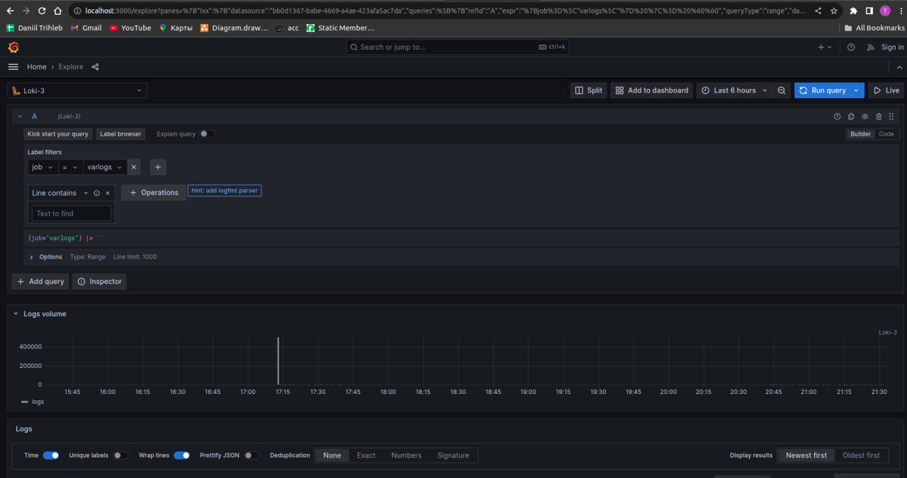
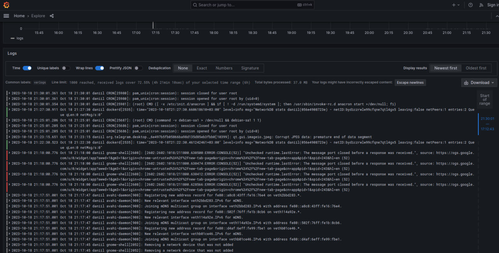

# Configuration Overview

## Loki

Loki is configured with the following notable settings:

 

1. Compactor:
 - Uses the local file system for its working directory.
 - The shared store is also the filesystem.

2.  Limits:
 - Old samples are rejected based on a max age of 168 hours (7 days).

3. Chunk Store:
 - The max_look_back_period is set to 0s, which means it will not look back for old chunks.

4. Table Manager:
 - Retention deletes are not enabled.
 - There is no specific retention period set.

5. Ruler:
 - Uses local storage for rules.
 - Rules and temporary rules are stored under /tmp/loki.

 

## Promtail

Promtail is set up with the following configuration:

1. Server:
 - HTTP listen port is 9080.
 - gRPC listen port is set to 0, effectively disabling it.

2. Positions:
 - The position file is stored under /tmp/positions.yaml.

3. Clients:
 - Promtail sends logs to Loki via the endpoint http://loki:3100/loki/api/v1/push.

4. Scrape Configs:
 - Targets localhost.
 - Scrapes logs from Docker containers.

 

## Grafana
Grafana is used for visualization:

1. Environment:
 - Provisioning path is set.
 - Anonymous authentication is enabled with Admin role.

2. Datasource Configuration:
 - Loki is set as the default datasource.
 - Connection to Loki is via proxy.

Access the Grafana dashboard via http://localhost:3000.
You can query logs from Loki using Grafana's interface.

 

## Screen shots

