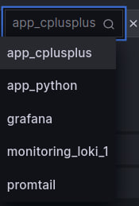
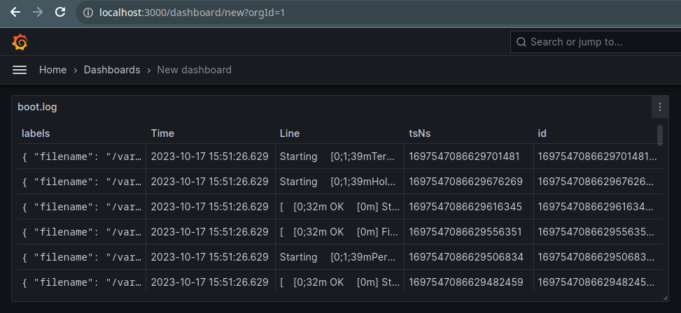

# Overview

This document describes the logging stack set up using Docker Compose, highlighting the roles and interactions of each component. The stack comprises of four main components: app_python, loki, promtail, and grafana.

## Components

1. #### app_python
Role: This is the primary application whose logs we want to monitor. While it's named app_python, it can represent any application container that generates logs.
Functionality:
The application runs and generates logs.
These logs are written to the container's standard output or error streams, which Docker captures.
2. #### loki
Role: Loki is a horizontally-scalable, highly-available, multi-tenant log aggregation system.
Functionality:
Loki does not index the content of logs but rather a set of labels for each log stream.
Compared to other logging systems, Loki is simpler and more cost-effective.
In this setup, Loki receives logs from Promtail and provides an interface for Grafana to query these logs.
3. #### promtail
Role: Promtail is an agent that ships the contents of local logs to a private Loki instance or Grafana Cloud.
Functionality:
Promtail is configured to scrape logs from the app_python Docker container.
Uses service discovery to find new targets, ensures the correct log format, and sends the logs to Loki.
In the given configuration, the scraped logs include system logs, Docker container logs, and others as defined in promtail-config.yaml.
Promtail also handles the extraction of metadata from logs (like the image name, container name, etc.) and sends this metadata alongside the logs to Loki.
4. #### grafana
Role: Grafana is an open-source platform for monitoring and observability. In this stack, it serves as the visual interface where logs are queried and displayed.
Functionality:
Grafana queries logs from Loki and displays them in a user-friendly manner.
In this setup, Grafana has been configured with Loki as a data source, ensuring seamless integration.
The entry point script configures Grafana to automatically create a datasource connected to the Loki instance.

## Interaction Flow

* `app_python` - generates logs during its operations.
* `promtail` - scrapes and processes these logs, extracting relevant metadata and forwarding the logs to loki.
* `loki` - receives and stores the logs.
* `grafana` - is set up to use Loki as a data source and visualize data.

