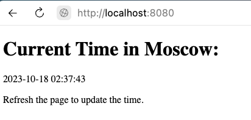
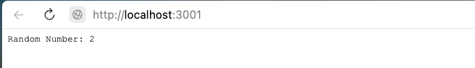
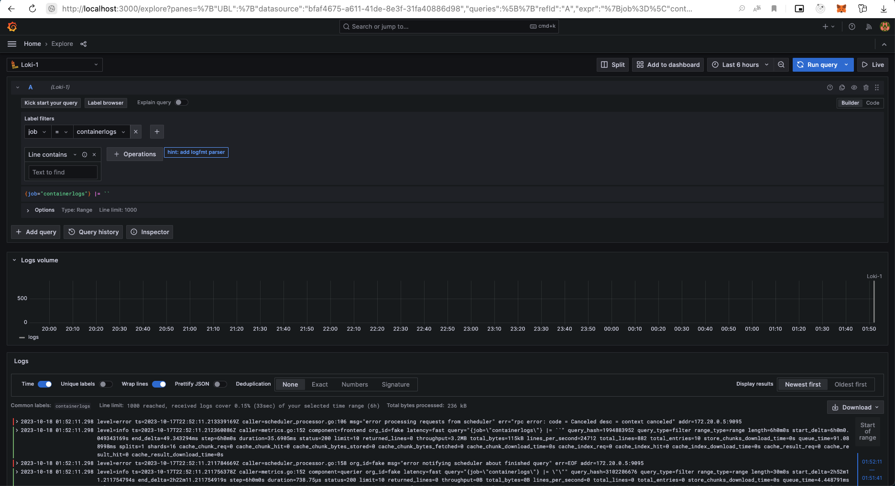

# Lab 7: Monitoring and Logging

## Task 1: Logging Stack Setup

### 1. Introduction & Logging Stack Components

The goal of this task is to prepare monitoring and visualising environment for the python and node app, as a network of connected containers (application containers & grafana & loki with promtail ). Then I will configure Loki, in order for it to monitor logs from all the running containers. And finally I wil use Grafana dashboard to visualize the scraped data.  

In order to visualiase and analyse logs, I will use **Grafana** it provides a nice UI for creating and cutomizing dashboards with panels. Also, it visualizes **metrics** and **logs** collected by a monitoring solution ( in our case it's going to be **Prometheus** and **Grafana Loki**).

In order to monitor my apps, I will use **Grafana Loki** - this is a monitoring solution like Prometheus, but focused on application logs. Those logs are collected by clients, instead of general metrics. 

### 2. Demo

All I need to do to get everything started is just to run `docker-compose up`, and verify that all containers are running. 

- Verify that the python application is running at *http://localhost:8080*

- Verify that the node application is running at *http://localhost:3001*

- Verify that Grafana UI is running at *http://localhost:8081*

1) After that I added data source, using the required url *http://loki:3100*

The final result of seeing the container logs will look like this : 

### 3. Dashboards

Now, we can finally make use of all the data collected by Loki. We can visualise the data using dashboard and also we can expor the data as a reusable JSON. 

### 4. Best Practices

- Utilize official documentation from Grafana and Loki for guidance.
- Craft logs that are detailed and adhere to a standardized format.
- Employ log rotation strategies to optimize memory and disk space usage.
- Develop straightforward dashboards with clear, meaningful titles.
- When setting up alert configurations, aim for activation only when necessary.
- Minimize dashboard reloading to alleviate network load and enhance efficiency.
