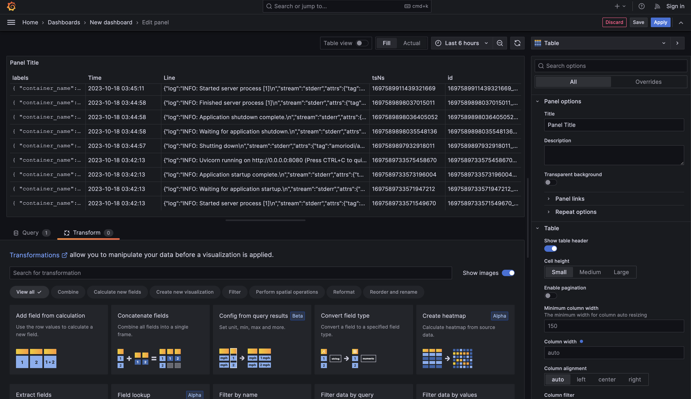

# Logging

My logging stack consists of **Grafana**, **Loki**, and **Promtail**.

### Grafana

Grafana is a powerful data aggregation and visualizing tool. In our stack it serves as a frontend for Loki data source

### Loki

Loki is a logs sggregation system, that allows effeciently collect and index logs from a different clients

### Promtail

Promtail is a log grabber agent, that monitors local logs, enrich them with metadata and send to Loki

### Screenshots

