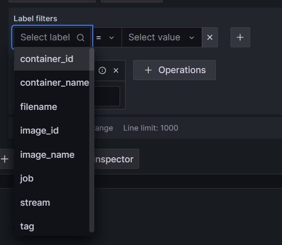
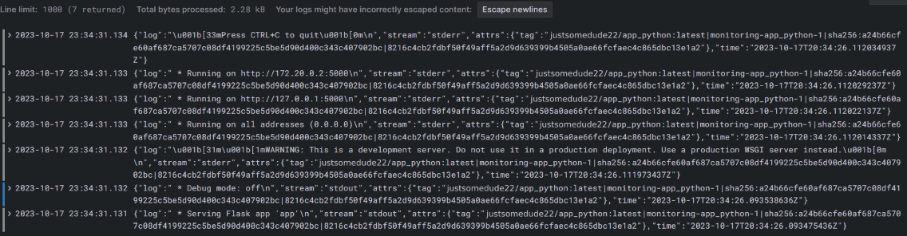

# Graphana

Grafana is an open-source data visualization and monitoring solution introduced on lab. There is no need to modify options for Grafana. Loki is used to obtain data.

# Loki

Loki is an open-source lightweight and scalable log aggregation system.

Default parameters are used.

# Promtail

Used to show logs for specific source.

Added following labels:

# Logs

## List of names of containers

## Python App logs

