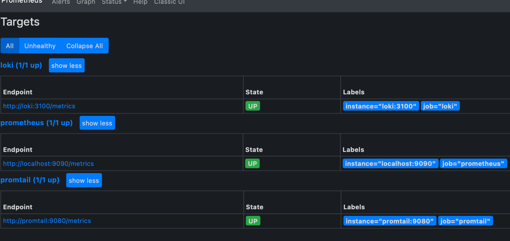

# Logging

## Loki

Loki is a highly scalable, multi-tenant log aggregation system inspired by Prometheus, designed for efficient storage and querying, and used as a data source in Grafana for real-time log data exploration

## Promtail

Promtail, part of the Loki project, is a lightweight agent that efficiently streams and enriches logs from various sources, sending them to Loki for storage and analysis

## Grafana

Grafana is an open-source data visualization and monitoring tool supporting multiple data sources, empowering users to create customizable dashboards for system performance, application metrics, and business data

