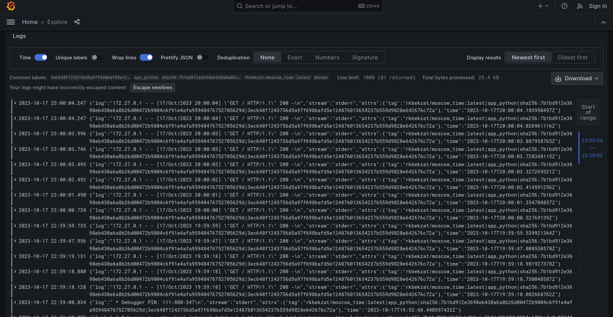

# Logging
## Logging stack
### Grafana

A free software data visualization system focused on data from monitoring systems.

### Loki
Loki is a horizontally scalable, highly available, multi-tenant log aggregation system inspired by Prometheus
### Promtail
Promtail is an agent which ships the contents of local logs to a private Grafana Loki instance
## Results 

