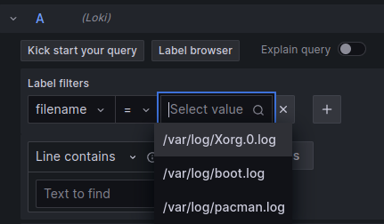

# Commands output:

- ```sudo docker-compose -f docker-compose.yml up -d```

```[+] Running 14/14
 ✔ promtail 6 layers [⣿⣿⣿⣿⣿⣿]      0B/0B      Pulled                                                                                                                                                                          13.9s 
   ✔ e67fdae35593 Pull complete                                                                                                                                                                                                2.4s 
   ✔ 0c43e1634402 Pull complete                                                                                                                                                                                                2.6s 
   ✔ bd78ca9b87d0 Pull complete                                                                                                                                                                                                3.1s 
   ✔ c1700593838f Pull complete                                                                                                                                                                                                3.2s 
   ✔ ef709c0357cc Pull complete                                                                                                                                                                                                4.5s 
   ✔ 971ff3a0f077 Pull complete                                                                                                                                                                                                3.9s 
 ✔ loki 6 layers [⣿⣿⣿⣿⣿⣿]      0B/0B      Pulled                                                                                                                                                                               7.9s 
   ✔ 7264a8db6415 Already exists                                                                                                                                                                                               0.0s 
   ✔ 91244ccba3b9 Pull complete                                                                                                                                                                                                0.8s 
   ✔ 24df308a4303 Pull complete                                                                                                                                                                                                1.5s 
   ✔ e1fde80b80fe Pull complete                                                                                                                                                                                                0.7s 
   ✔ 735126c0940c Pull complete                                                                                                                                                                                                1.5s 
   ✔ d5c964c80c23 Pull complete                                                                                                                                                                                                2.3s 
[+] Running 4/4
 ✔ Network monitoring_loki          Created                                                                                                                                                                                    0.1s 
 ✔ Container monitoring-grafana-1   Started                                                                                                                                                                                    0.1s 
 ✔ Container monitoring-loki-1      Started                                                                                                                                                                                    0.1s 
 ✔ Container monitoring-promtail-1  Started           
```                                                                                                                                             
                                                                                                                                                                       0.1s 
- ```sudo docker ps```

```
CONTAINER ID   IMAGE                    COMMAND                  CREATED         STATUS         PORTS                                       NAMES
eb05f554ca28   grafana/promtail:2.9.2   "/usr/bin/promtail -…"   5 seconds ago   Up 4 seconds                                               monitoring-promtail-1
d3e0b80111dd   grafana/loki:2.9.2       "/usr/bin/loki -conf…"   5 seconds ago   Up 4 seconds   0.0.0.0:3100->3100/tcp, :::3100->3100/tcp   monitoring-loki-1
222be4bd6588   grafana/grafana:latest   "sh -euc 'mkdir -p /…"   5 seconds ago   Up 4 seconds   0.0.0.0:3000->3000/tcp, :::3000->3000/tcp   monitoring-grafana-1

```

# Grafana


Grafana is a software data visualization system focused on data from IT monitoring systems. We can configure data sources within Grafana, and make dashboards with visualizations of metrics from these data sources.

Example of visualization from Loki datasource:


# Loki

Loki is a system for aggregating logs from multiple sources. I used a common configuration that collects logs from ```/var/log/``` repository.

Examples of logs file collected by Loki:


# Promtail

Promtail is an agent that sends the contents of local logs to the Grafana Loki instance. So, it provides Loki with ```/var/log/``` files.