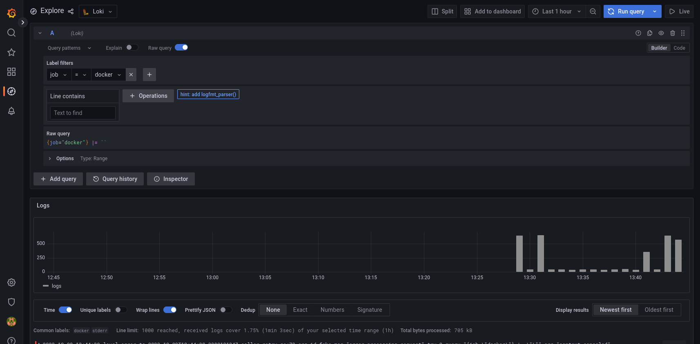
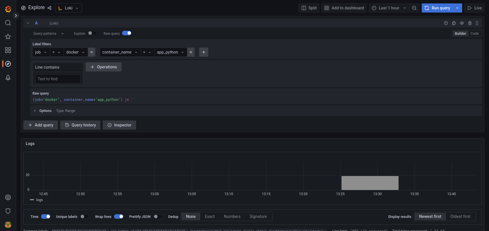

# Logging

# Logging

## Loki

Loki is a lightweight and efficient log aggregation system designed for storing and analyzing log data. 
It allows to centralize logs from various sources, search and filter logs efficiently, and gain visibility into system behavior, 
troubleshoot issues, and monitor application performance.

Loki starts at `loki:3100`.

## Promtail

Promtail is a lightweight log shipper. Promtail is needed to collect and forward log data from various sources to 
a centralized log aggregation system. It enables real-time log streaming, parsing, filtering, and 
integration with log storage solutions like Loki.

In the project Promtail has `promtail` directory with config file, starts at `promtail:9080`

## Grafana

Grafana is a powerful data visualization and monitoring tool that is widely used in various 
industries and organizations. Grafana allows to visualize and monitor data, gain insights, track system performance, 
and make data-driven decisions.

Grafana starts at `grafana:3000`.

# Best practices

## Data Source Configuration

I properly specify Loki datasource for grafana.

## Config file utilisation

I created a separate config file for Promtail and formed it according to official guide.

## Network naming

I explicitly specify name of the network for easier usage.

## Run

`docker compose up -d --pull always`

docker-compose.yml includes Loki, Promtail, Prometheus, Grafana, and Python + Rust apps

## Using

Grafana & loki works

###Docker logs

### Python logs

app_python

