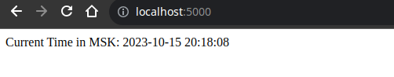
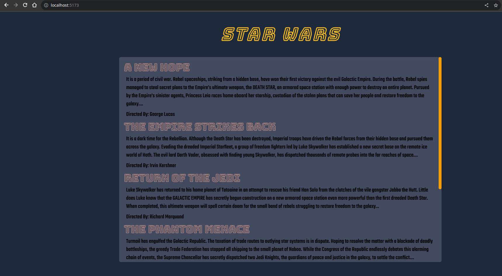
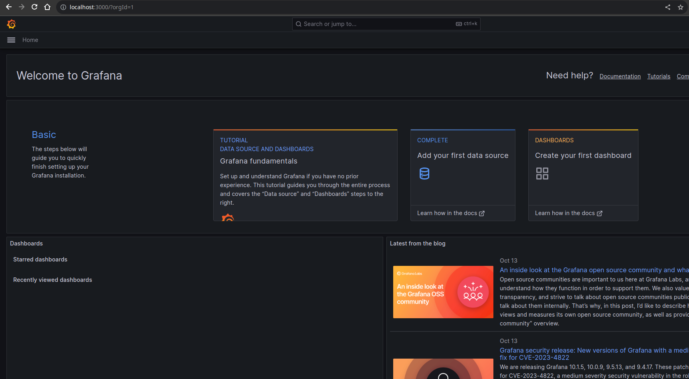
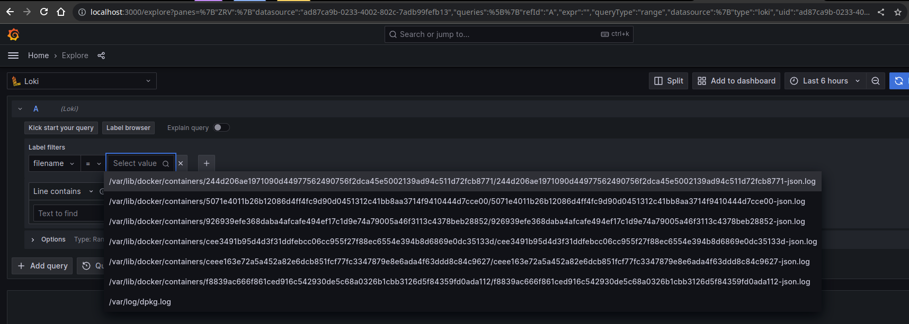
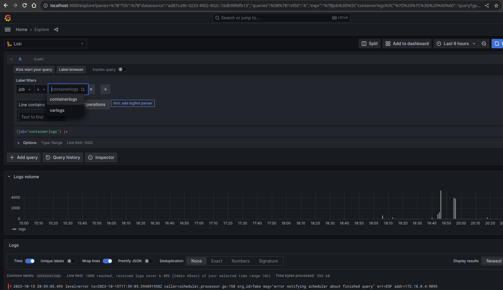
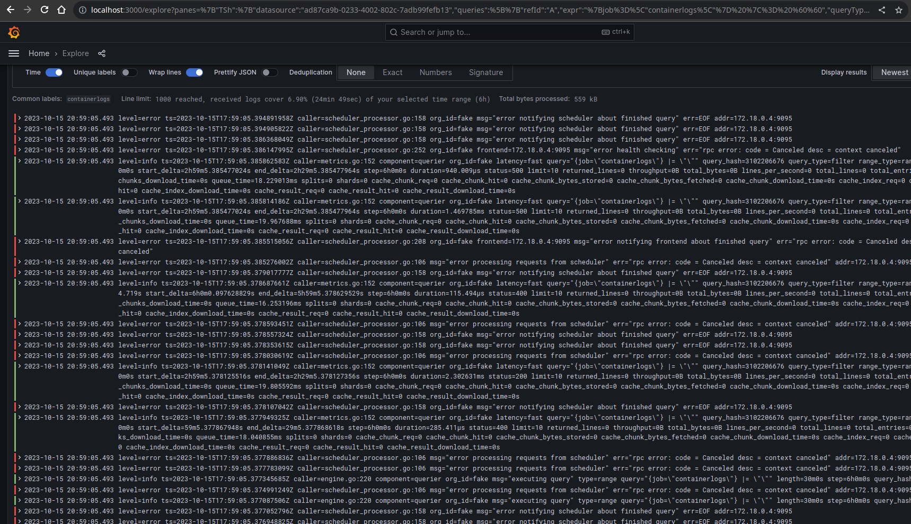

# Logging, Monitoring, and Visualization

## 1. Observability Stack

### 1.1. Grafana

- A web application used mainly for visualization and analytics. Once deployed (e.g., as a docker image), it provides a nice UI for creating and customizing **dashboards** with **panels** (containing **graphs**, **bars**, **gauges**, **charts**, etc.) to visualize **metrics** or **logs** collected by a **monitoring** solution (e.g., **Prometheus** or **Grafana Loki**) from different systems or databases.
- It can be used to configure **alerts** and has a **[plugin](https://grafana.com/grafana/plugins/)** system to extend its functionality and integrate with other tools.

### 1.2. Grafana Loki

- A monitoring solution like Prometheus, but focused on application **logs** (collected by **[clients](https://grafana.com/docs/loki/latest/clients/)**) instead of general metrics.
- Logs are stored as compressed objects and indexed for high efficiency, they can be queried using **LogQL**.

### 1.3 Promtail

- Promtail is a log shipping agent designed to work seamlessly with Grafana Loki, a powerful log aggregation and querying system. It serves as a key component in the observability stack, enabling the collection and forwarding of log data from various sources for analysis and visualization within the Grafana ecosystem.

## 2. Steps

### 2.1. Logging

- Make sure the application generates logs that can be accessed when running the container.

### 2.2. Exporting logs

- An HTTP endpoint to retrieve application logs by Loki

### 2.3. Preparing Environment

- Write a [docker-compose.yml](../monitoring/docker-compose.yaml) for deploying the application with the logging and monitoring stack in a single network [[ref.](https://github.com/grafana/loki/blob/main/production/docker-compose.yaml)].
- Write [configuration files](../monitoring/config) for Loki [[ref.](https://grafana.com/docs/loki/latest/configuration/examples/)], Promtail [[ref.](https://grafana.com/docs/loki/latest/clients/promtail/configuration/)].

  - The **Loki configuration** specifies the internal configurations for the Loki server and determines the storage location for logs, be it local or remote.
  - Within the **Promtail configuration**, you can find details about the Promtail server, the storage of positions, and instructions on how to extract logs from files.

- Run both containers with a `command` that specifies config file location.

### 2.4. Demo

- Run `docker-compose up` and verify that all containers are running.

- Verify that the app is running at <http://localhost:5000>

  

- Verify that the bonus app is running on <http://localhost:5173>

  

- Verify Grafana UI is accessible at <http://localhost:3000>

  - Default credentials: `admin:admin`

    

- Configuration &rarr; Data source &rarr; Add data source

  - &rarr; Loki &rarr; URL = `http://loki:3100` &rarr; Save and test.

- Explore &rarr; Loki &rarr; Add query &rarr; Write PromQL query or use UI builder.

  - Logs are displayed successfully

    
    
    

  - Now we can create dashboards to display/export data collected by Loki.

    

## 3. Best Practices

- Minimize unnecessary dashboard refreshes to reduce network traffic.
- Generate clear, structured logs following a standardized format.
- Configure alerts to trigger only when necessary.
- Implement log rotation to optimize memory and disk storage usage.
- Create straightforward and easily understandable dashboards with meaningful titles.
- Followed best practices in the official guides: [Grafana](https://grafana.com/docs/grafana/latest/best-practices/), [Loki](https://grafana.com/docs/loki/latest/best-practices/)
