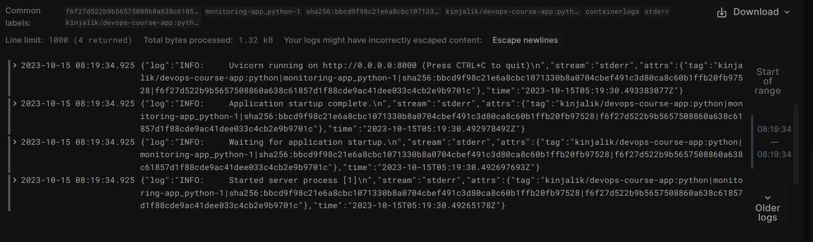
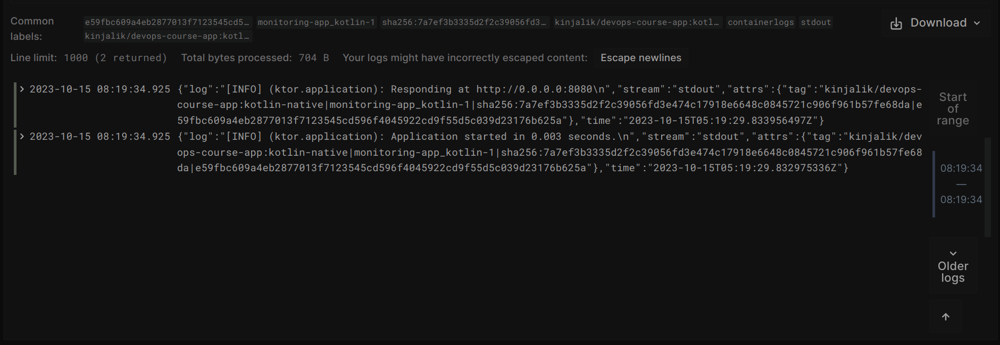
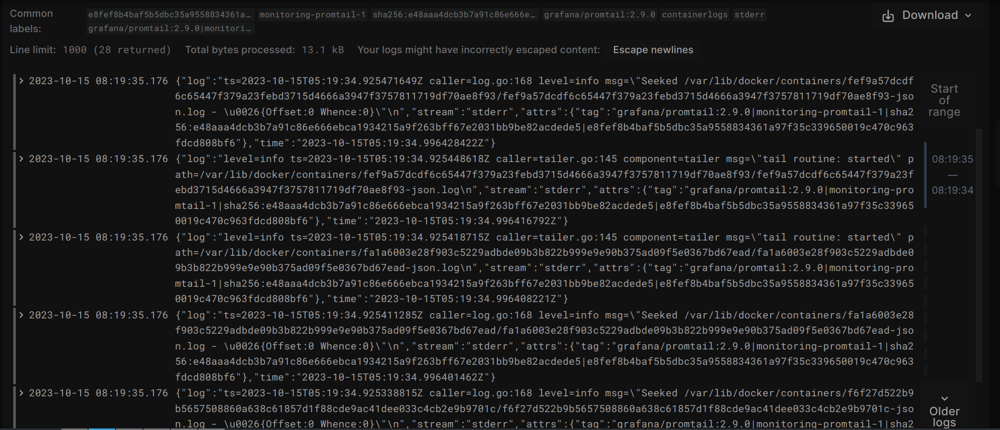

# Logging
## Graphana
Used to access the log using pretty UI.

In this case we use graphana with default options. We add Loki's datasource from compose.

## Loki
Concentrates the logs.

Used with totally default config from image

## Promtail
Brings the logs from given sources.

In this solution we keep tracking of logs with the following tags:

## The result
### List of containers

### Python app logs

### Kotlin Native app logs

### Promtail logs
