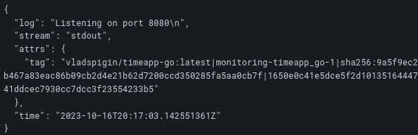

# Logging
## Stack:
### Tools
* Loki is log aggregation system.
* Grafana is needed to visualize logs in GUI with flexible configuration of aggregations and    visualizing methods.
* Promtail is an agent which ships the contents of local logs to Loki.

## Logs:
To clarify, the logs generated by both Python and Golang applications are directed to the stdout (standard output) and are then gathered by Promtail. All the containers, including the logging stack consisting of Grafana, Loki, and Promtail, are set up with the same logging driver. This ensures that identical labels are utilized for all containers.

## Grafana logs:

## Python logs:

## Go logs:
