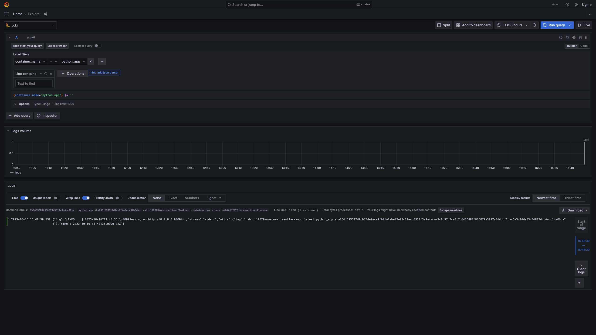
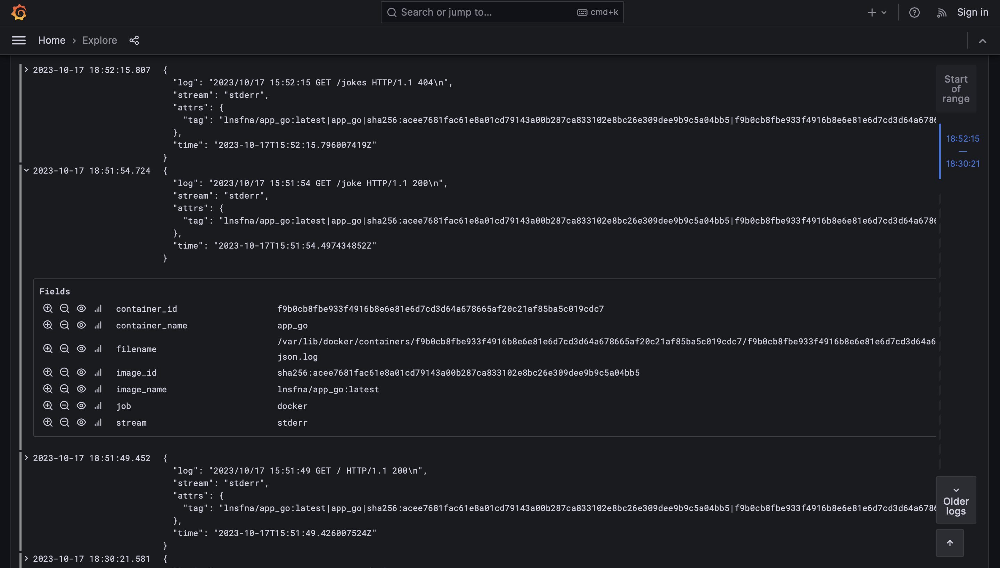

# Logging

## Logging stack

### Graphana

Grafana is an open source interactive data-visualization platform, developed by Grafana Labs, which allows users to see their data via charts and graphs that are unified into one dashboard

### Loki

Loki is a log aggregation system designed to store and query logs from all your applications and infrastructure.

### Promtail

Promtail is an agent which ships the contents of local logs to a private loki instance. In my case I also provide a custom config for promtail `./promtail-conf.yaml` which collect logs from all containers defined in the `docker-compose.yml`

## Logging stack results

### App Python

### App Go

### Graphana

### Loki

### Promtail

