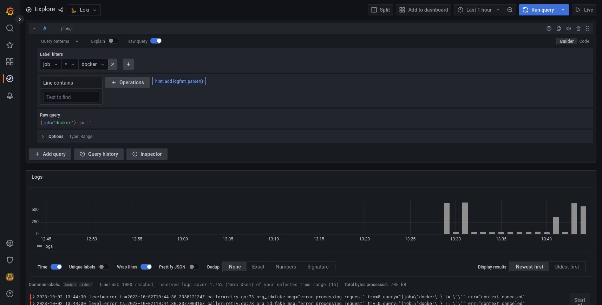
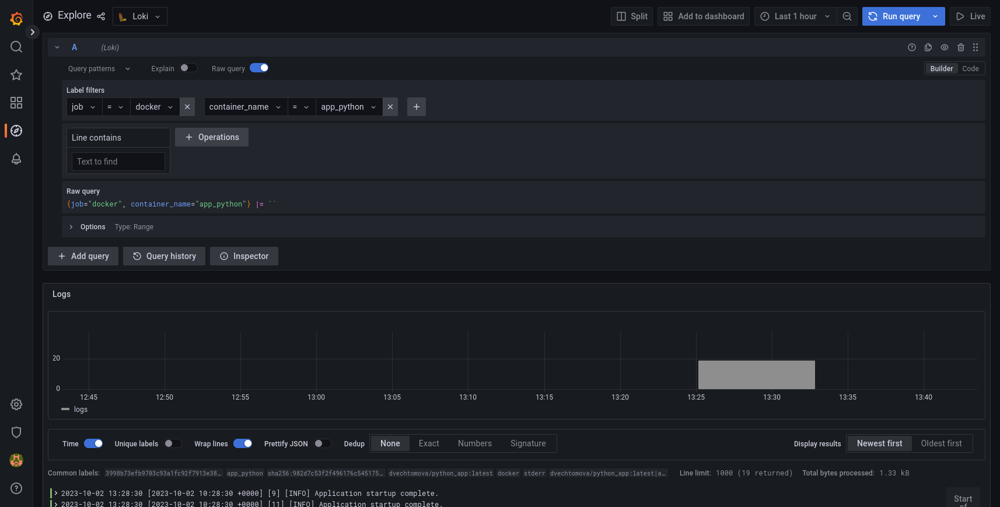
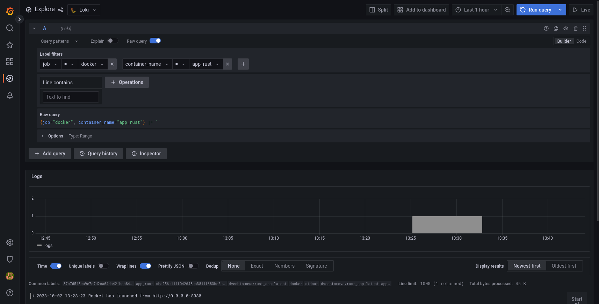

# Logging

## Run

`docker compose up -d --pull always`

[docker-compose.yml](File) includes Loki, Promtail, Prometheus, Grafana, and Python + Rust apps

## Using

### We can select by job

docker job

### Python logs

app_python container name

### Rust logs

app_rust container name

