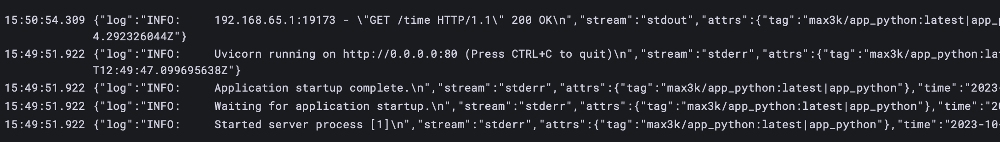

# Logging overview

## Grafana && Loki

Grafana is a tool for visualizing data. Loki is a tool for collecting logs, here it collects logs from containers and stores them in json format, which is then visualized by Grafana.

### Implementation

Here I used default implementation of Grafana & Loki, which is recommended in
lab [Example Docker Compose Configuration from Loki Repository](https://github.com/grafana/loki/blob/main/production/docker-compose.yaml)

## Promtail

Promtail is a tool for collecting logs from containers and sending them to Loki. It is configured to collect logs from all containers defined in the `docker-compose.yml`. So, here I defined configuration in `promtail/config.yml` file.

## Results

For clear logs there are tags, which include ImageName, and Container name.

### The examples of lalels (which allow filtering the logs)

### The examples of logs

Here we can see tags like `container_name`, `image_name`
