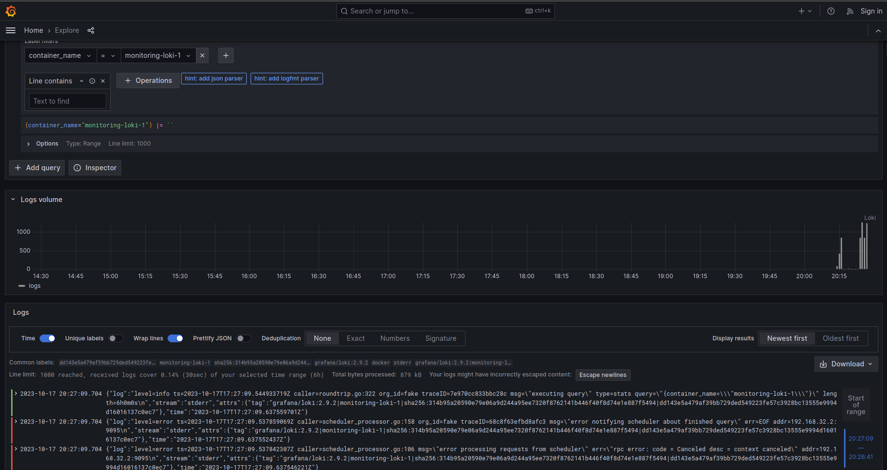

# Logging

## Logging stack

* **Grafana** is powerfull tool to visualize logs in GUI.
* **Loki** is log aggregation system.
* **Promtail** is an agent that ships the contents of logs to **Loki**.

## Specific information

I have such log format in JSON:

```json
{
  "log": "message",
  "stream": "stream",
  "attrs": {
    "tag": "image_name|container_name|image_id|container_id"
  },
  "time": "yyyy-mm-ddThh:mm:ss.nsZ"
}
```

I have such tags:

- image_name

- container_name

- image_id

- container_id

- filename

## Results

### Python App Logs


### C# App Logs


### Grafana Logs


### Loki Logs


### Promtail Logs
