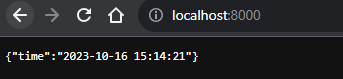

# Logging

This logging stack centralizes, searches, analyzes, and visualizes logs efficiently, simplifying the monitoring and troubleshooting of issues in my FastAPI and JS application. It also offers the flexibility to create custom dashboards and alerts tailored to your specific requirements.

It also captures logs directly from logging containers itself, so I can analyze logs from promtail, loki and grafana directly

## Components

### Loki

- **Role**: Loki is a log aggregation system designed for collecting, indexing, and storing log data from various sources.
- **Functionality**:
  - Loki stores log entries received via HTTP POST requests.
  - It efficiently indexes and stores log data for querying.
  - Loki provides a query language similar to PromQL for log searching and filtering.
  - Efficient storage is achieved using chunked storage and indexing.

### Promtail

- **Role**: Promtail is a log collector responsible for scraping log data from different sources and forwarding them to Loki.
- **Functionality**:
  - Promtail scrapes log files from sources like log files on the host machine.
  - It adds labels to log entries based on their source and other metadata.
  - Promtail forwards the labeled log entries to Loki using HTTP POST requests.
  - Labels make it easier to query and filter logs in Grafana.

### Grafana

- **Role**: Grafana is a monitoring and observability platform used for querying, visualizing, and alerting on logs stored in Loki.
- **Functionality**:
  - Grafana connects to Loki as a data source to query log data.
  - Users can create dashboards and panels to visualize logs in various formats.
  - Grafana supports alerting based on log query results, enabling notifications for specific log events.
  - Templating and variable features in Grafana allow dynamic filtering and exploration of log data.

## Overall Workflow

1. My containers generate log entries, which can be in log files or another format.

2. Promtail is configured to scrape log files, extract log entries, and add labels for identification. It is using host docker socket to collect logs directly

3. Promtail forwards the labeled log entries to Loki.

4. Loki indexes and efficiently stores the log entries.

5. Grafana connects to Loki as a data source, allowing users to query and visualize log data using custom dashboards.

6. Users can set up alerts and notifications in Grafana based on specific log events or conditions.

## Screenshots

### Dashboard  
  
### JS App  
  
### Python App  
  
### Promtail  
  