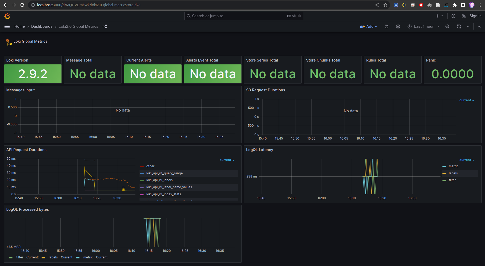

# Monitoring and Logging

## Components

- **Promtail**: log shipping agent used to collect, enrich, and forward log data to Grafana Loki for centralized log aggregation and analysis.
- **Loki**: horizontally-scalable log aggregation system that helps store, index, and search logs for efficient troubleshooting and observability.
- **Grafana**: visualizes logs from Loki.

File `promtail-config.yml` contains configuration settings for promtail to collect logs from all containers.

## Functionality

