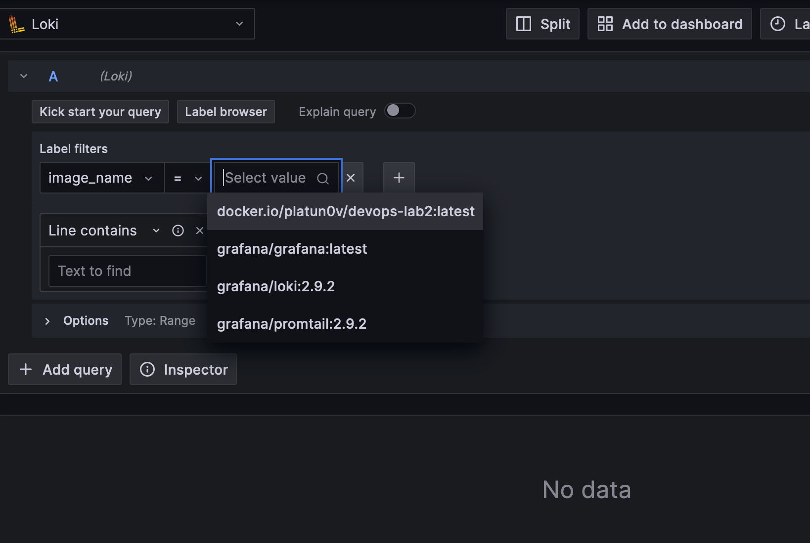
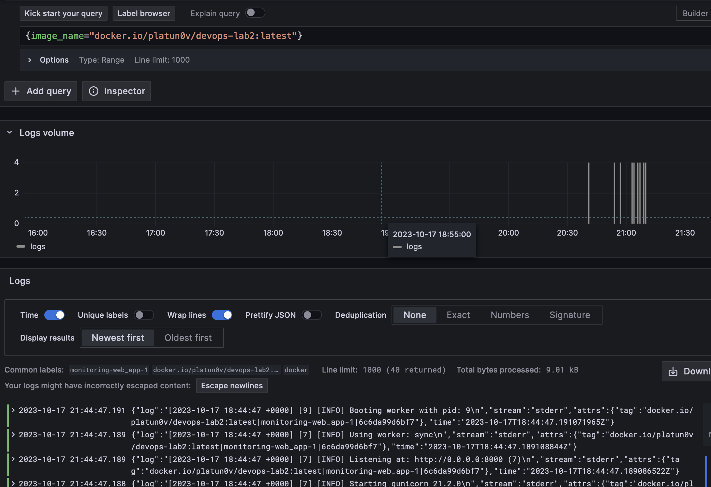

# Logging

## Grafana

Used to access the log using pretty UI.

In this case we use grafana with default options. We add Loki's datasource from compose.

## Loki

Concentrates the logs.

Used with totally default config from image

## Promtail

Brings the logs from given sources.

## Result

### List of containers

### Python app logs

### Promtail logs

