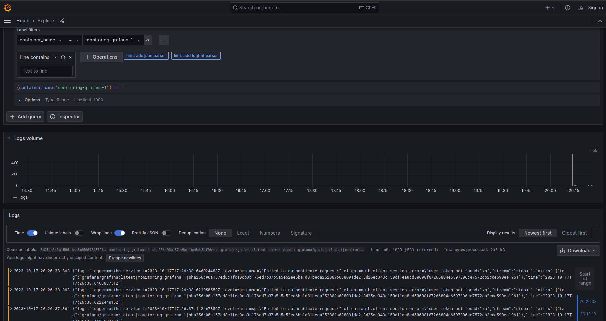

# Logging Stack Report

## Introduction
This document provides an overview of the logging stack implemented in the Docker Compose configuration. The stack is designed to capture and manage logs from multiple services using Grafana, Loki, and Promtail.

## Configuration

All configurations were obtained from: https://gist.github.com/ruanbekker/c6fa9bc6882e6f324b4319c5e3622460

To run the docker compose I use this command:
```
docker-compose -f docker-compose.yaml up
```

## Components

### 1. app_python
- **Image:** arseniy5443/moscowtime:latest
- **Port:** 80:5000

#### Logging Configuration
- **Driver:** json-file
- **Log Tag Format:** "{{.ImageName}}|{{.Name}}|{{.ImageFullID}}|{{.FullID}}"
  
#### Role
- The `app_python` service is a Python application that serves on port 5000.
- It generates logs using the configured logging driver.

### 2. app_javascript
- **Image:** arseniy5443/randomquote:latest
- **Port:** 5000:3000

#### Logging Configuration
- **Inherited from app_python using an anchor.**

#### Role
- The `app_javascript` service is a JavaScript application serving on port 3000.
- It reuses the logging configuration from `app_python` to ensure consistent log tagging.

### 3. loki
- **Image:** grafana/loki:2.9.1
- **Port:** 3100:3100

#### Logging Configuration
- **Inherited from app_python using an anchor.**

#### Role
- The `loki` service is Grafana Loki, a log aggregation and querying system.
- It receives and indexes logs from the Docker containers using the same logging configuration for consistency.

### 4. promtail
- **Image:** grafana/promtail:2.9.1
- **Volumes:** /var/lib/docker/containers, ./promtail-config.yaml:/etc/promtail/config.yml

#### Logging Configuration
- **Inherited from app_python using an anchor.**

#### Role
- The `promtail` service is responsible for collecting logs from Docker containers.
- It reads logs from the specified volumes and forwards them to Loki.
- The logging configuration ensures that logs are tagged consistently.

### 5. grafana
- **Image:** grafana/grafana:latest
- **Port:** 3000:3000

#### Logging Configuration
- **Inherited from app_python using an anchor.**

#### Role
- The `grafana` service is Grafana, a platform for creating and sharing dashboards.
- It is configured to use Loki as a data source for querying and visualizing logs.
- The logging configuration ensures logs generated by Grafana are tagged consistently.

## How the Stack Works

1. Logs are generated by the `app_python` and `app_javascript` services using the specified logging driver and tag format.

2. Promtail collects logs from Docker containers (including `app_python` and `app_javascript`) by reading log files from the specified volumes.

3. Promtail forwards the logs to Loki, where they are indexed and made available for querying.

4. Grafana, configured to use Loki as a data source, can query the log data and create dashboards and panels for log visualization.

## Conclusion
This logging stack effectively collects, indexes, and visualizes logs from multiple services using Grafana, Loki, and Promtail. The consistent log tagging and well-structured architecture make log management and analysis more accessible and maintainable.

## Results

To find the logs type in browser:
```
http://localhost:3000/
```
Then login and click on menu, then connections, then datasources, then loki, then explore data, set the configuration and run query.

### Choose label:


### Select value:


### App python logs:


### App javascript logs:


### Grafana logs:


### Loki logs:


### Promtail logs:
