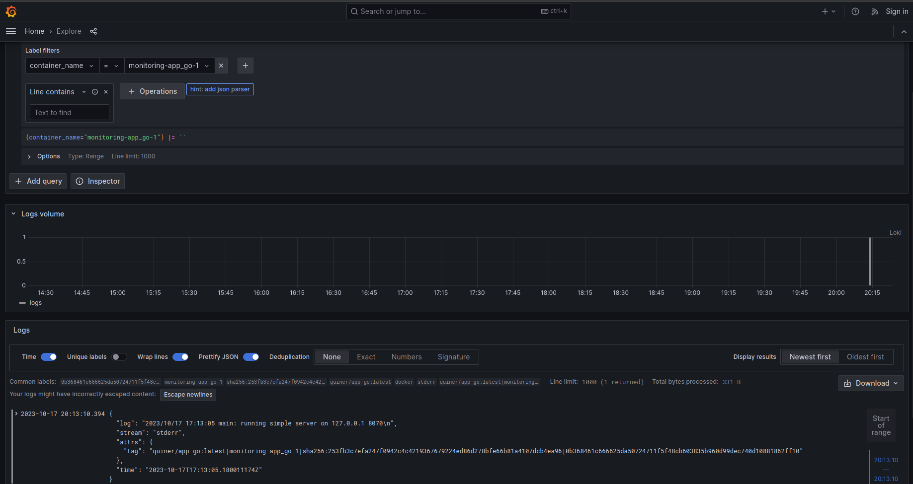

# Logging
## Logging stack:
### Loki
Efficient log aggregation system designed to store and query logs from all applications and infrastructure.

Used with default config, starts at `loki:3100`

### Promtail
Agent for shipping logs from different sources to Grafana Loki instance

Used with config from `promtail` directory, starts at `promtail:9080`

### Grafana
Software for querying, visualizing and exploring your metrics and logs.

Used with default options and datasource config in docker-compose, starts at `grafana:3000`

## Results:
### Containers:

### Python app logs

### Go app logs

### Loki logs

### Promtail logs

### Grafana logs

