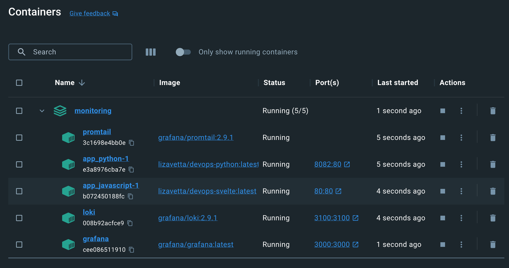

# Logging

## Loki
Loki is a horizontally scalable, highly available, multi-tenant log aggregation system. It is used as the log storage backend for Grafana.

Used default configs.

## Promtail
Promtail is a log collector and shipper for Loki. It is used to collect logs from different sources, such as container logs, and send them to Loki for storage and querying.

## Grafana
Grafana is an analytics and visualization platform that allows users to create and display real-time graphs, charts, and dashboards. It is used to monitor and visualize the logs and metrics from the services.

Used default options. We add Loki's datasource from compose.

## Screenshots
### List of containers

### Grafana logs

### Python application logs

### Go application logs

## References

[docker-compose.yml](https://github.com/grafana/loki/blob/main/production/docker-compose.yaml)

[promtail_config.yml](https://gist.github.com/ruanbekker/c6fa9bc6882e6f324b4319c5e3622460)