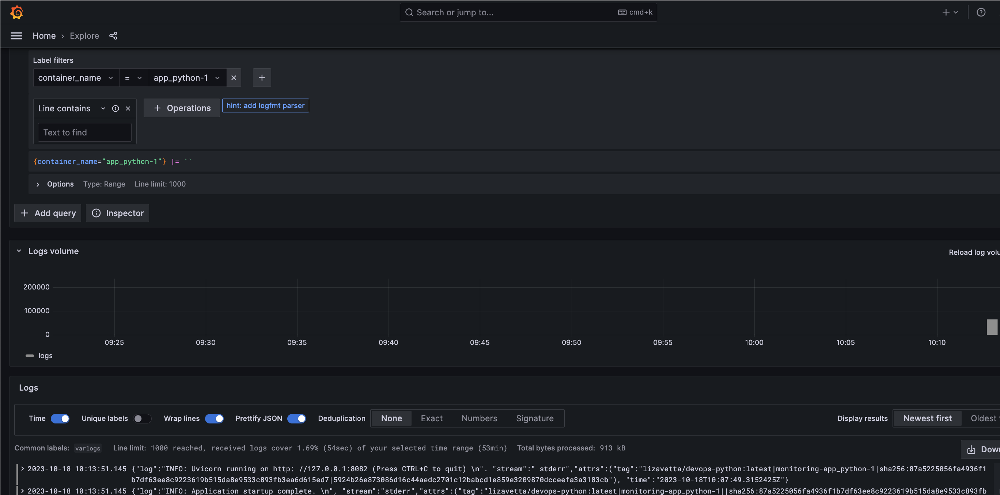
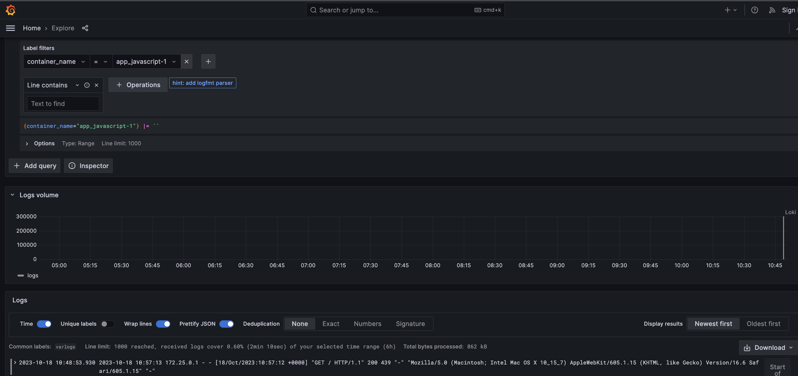

# Logging 

It is done with the power of Grafana, Promtail, and Loki.

Use `docker-compose up` from the `monitoring` directory to
start.

## The results

Here we can check any label  

### Python logs

Check for `container_name` is `app_python-1`

### Javascript logs

Check for `container_name` is `app_javascript-1`

