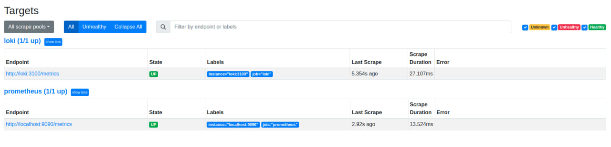

## Project Metrics Overview

This document provides an overview of the key metrics that are monitored within our project. These metrics help in assessing the health, performance, and progress of the application and give insights for better decision-making.

### Table of Contents

1. [Usage Metrics](#usage-metrics)
2. [Performance Metrics](#performance-metrics)
3. [Reliability Metrics](#reliability-metrics)
4. [Business Metrics](#business-metrics)
5. [Monitoring Tools](#monitoring-tools)

---

## Usage Metrics

### Active Users
* **Description:** Measures the number of active users interacting with our application.
* **Metric Type:** Counter
* **Collection Frequency:** Daily

### Session Duration
* **Description:** The average length of time a user spends in a single session.
* **Metric Type:** Gauge
* **Collection Frequency:** Real-time

---

## Performance Metrics

### Response Time
* **Description:** Measures the time taken to process a request and return a response.
* **Metric Type:** Histogram
* **Collection Frequency:** Real-time

### Throughput
* **Description:** The number of requests processed per second.
* **Metric Type:** Counter
* **Collection Frequency:** Real-time

---

## Reliability Metrics

### Error Rate
* **Description:** The percentage of all requests that resulted in an error.
* **Metric Type:** Percentage
* **Collection Frequency:** Real-time

### Uptime
* **Description:** Measures the system's operational performance and reliability. 
* **Metric Type:** Percentage
* **Collection Frequency:** Monthly

---

## Business Metrics

### Monthly Revenue
* **Description:** The total revenue generated from the project in a month.
* **Metric Type:** Gauge
* **Collection Frequency:** Monthly

### Customer Acquisition Cost (CAC)
* **Description:** The cost associated with acquiring a new customer.
* **Metric Type:** Gauge
* **Collection Frequency:** Monthly

---

## Monitoring Tools

* **Prometheus:** Used for collecting and storing system metrics.
* **Grafana:** Used for visualizing the data from Prometheus in dashboards.
* **Loki:** Used for log aggregation and querying.

---

### Task Screenshots

