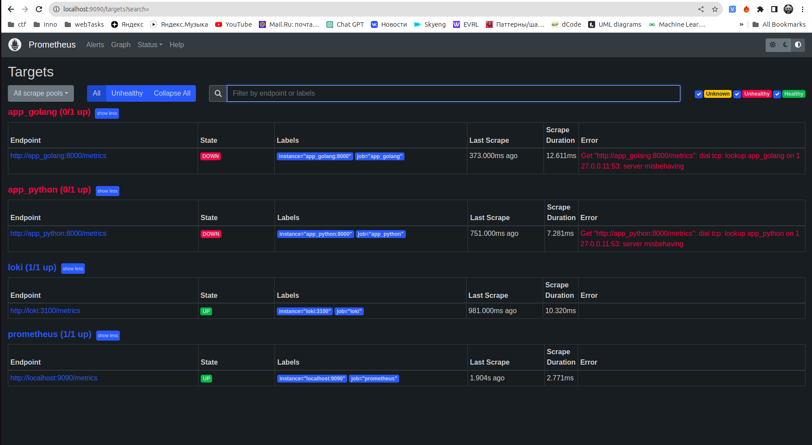
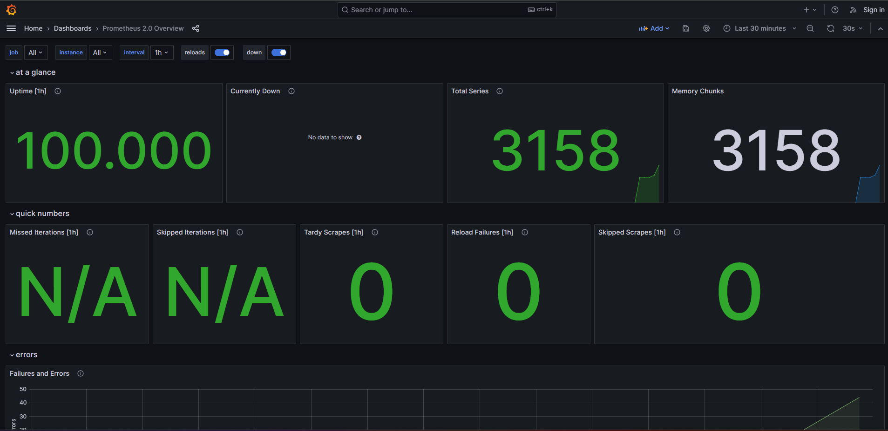
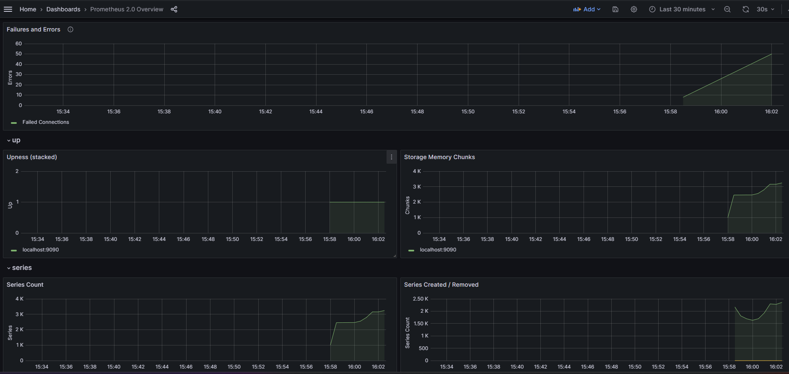
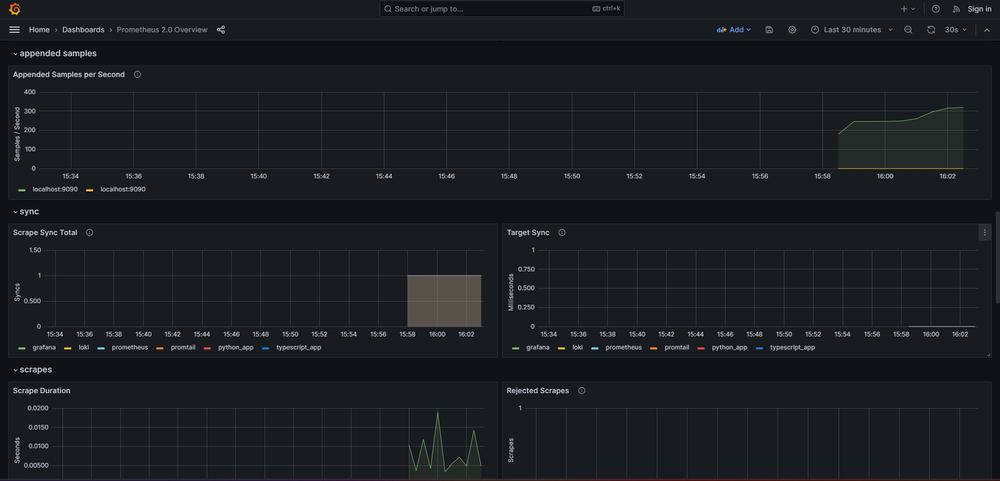

# Metrics
## Configuration


## Bonus task
- Added metrics for the `python_app` service via `django-prometheus` python package:
```python
from prometheus_client import Counter, Histogram

request_latency = Histogram("request_latency_seconds", "Request latency in seconds")
request_count = Counter("request_count", "Request Count")
@request_latency.time()
```

- Added metrics for the `typescript_app` service via `prom-client` using npm packages

```typescript
import { collectDefaultMetrics, Registry, register } from 'prom-client';
const registry = new Registry();

const requestCounter = new Counter({ name: 'request_count', help: 'Request Count' });
registry.registerMetric(requestCounter);

requestCounter.inc();
app.get('/metrics', (req, res) => {
  res.set('Content-Type', register.contentType);
  res.end(registry.metrics());
});

collectDefaultMetrics({ register: registry });

```

- Added simple healthcheck in `docker-compose.yaml` using `curl` to check if url is working.

## Prometheus `http://localhost:9090/targets`



## Grafana Dashboard for Prometheus



