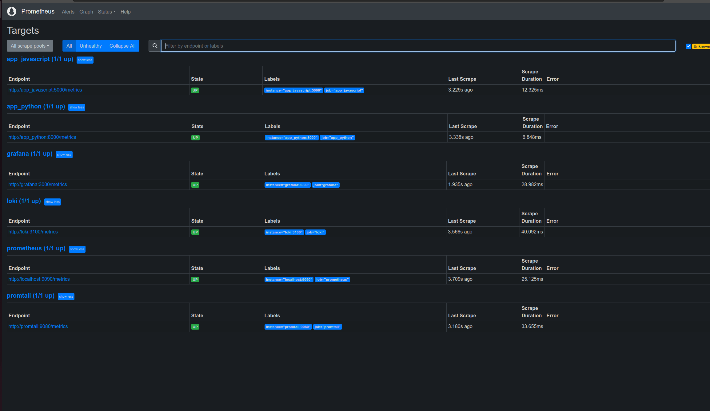
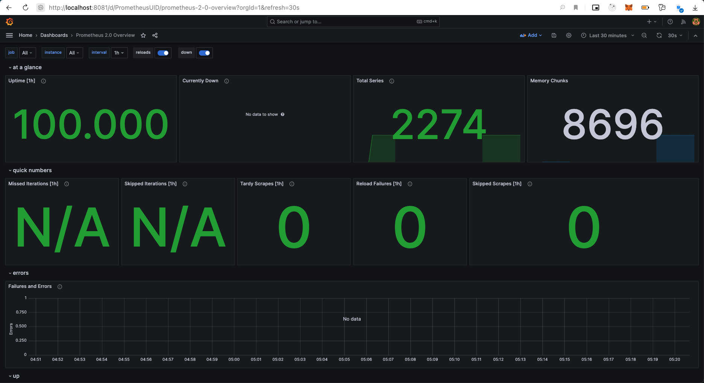
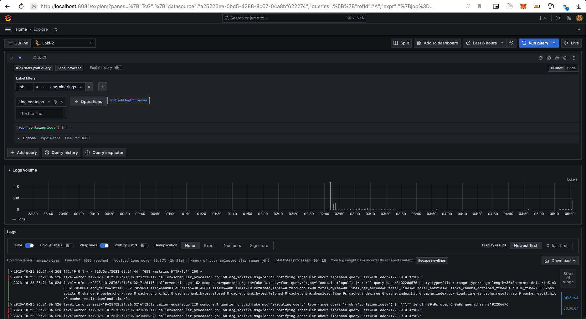

## Prometheus http://localhost:9090/targets


## Bonus task metrics 
### App_python 
Added metrics using 

```python
from prometheus_fastapi_instrumentator import Instrumentator

@app.on_event('startup')
async def startup():
    Instrumentator().instrument(app).expose(app)

```

### App_javascript
Added metrics using express-prom-bundle
```javascript
// Create a Prometheus metrics bundle using express-prom-bundle
const metricsMiddleware = promBundle({
  includeMethod: true,
  includePath: true,
});
```

## Dashboard

### Dashboard for prometheus 


### Dashboard for loki
