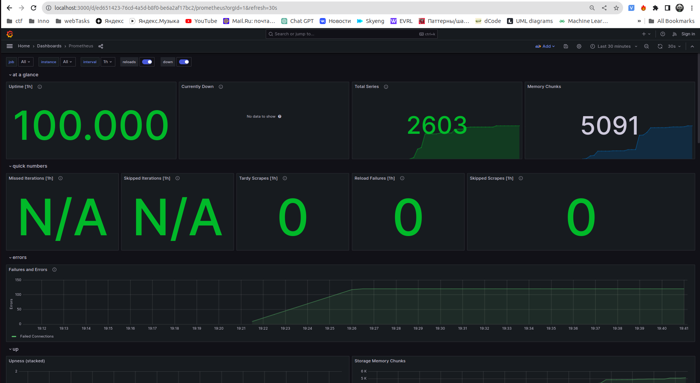

# Metrics

## Prometheus targets

Prometheus is successfully scraping metrics from 4 apps:
- Prometheus
- Loki
- App Python
- App Golang


## Grafana dashboards

Used external dashboards:
[Loki](https://grafana.com/grafana/dashboards/13407),
[Prometheus](https://grafana.com/grafana/dashboards/3662)

### Loki


### Prometheus



## Service configuration

### Log rotation

All logs are stored in the json-format and if they reach a `max-size` limit, then they will be rotated.

```yaml
max-size: "100m"
max-file: "2"
```

### Memory limits

All services have memory limit that is described in `docker-compose.yml` file:

- **app_python**: 256 MB
- **app_golang**: 256 MB
- **loki**: 512 MB
- **promtail**: 512 MB
- **grafana**: 1 GB
- **prometheus**: 1 GB

To set these limits, I used docker compose v3 format:

```yaml
deploy:
  resources:
    limits:
      memory: 256m
```

