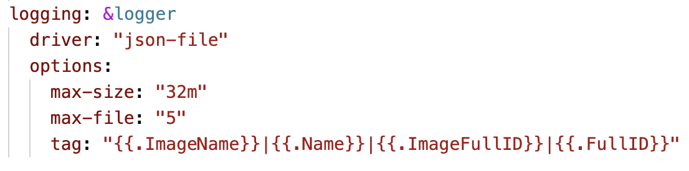
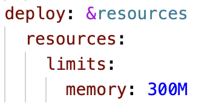
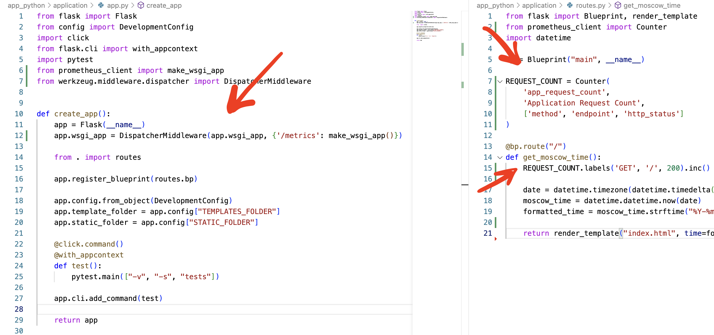
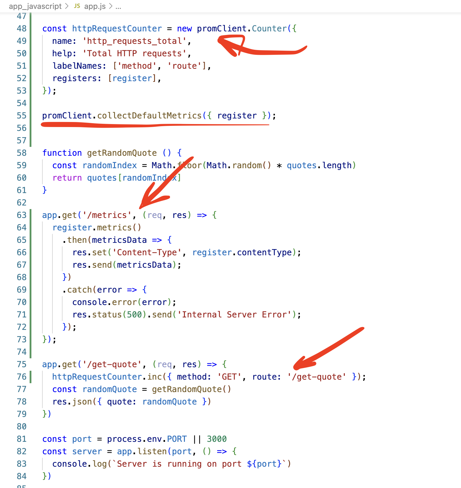
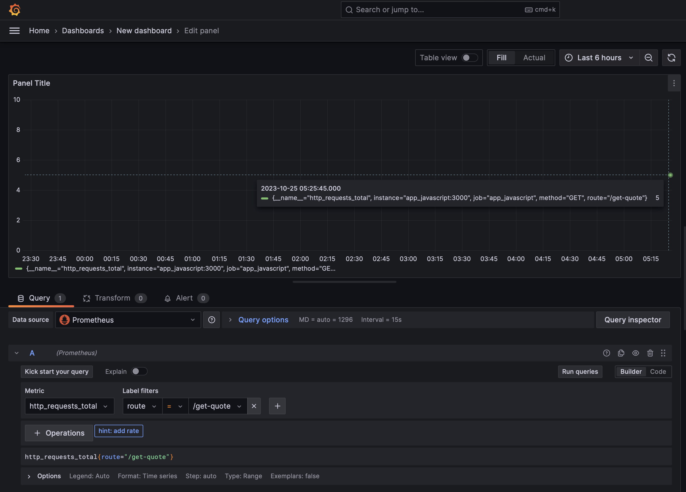
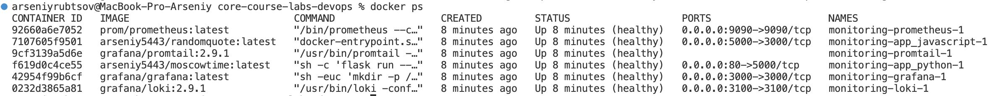

# Monitoring with Prometheus

Command to run docker-compose:
```
docker-compose -f docker-compose.yaml up
```

### Screenshot that confirm the successful setup:


To set up a dashboard we need to go to http://localhost:3000, then go to dashboards -> new -> import. Then add urls of dashboards:
https://grafana.com/grafana/dashboards/13407
https://grafana.com/grafana/dashboards/3662

Then load, choose prometheus as source and import.

### Screenshots displaying your successful dashboard configurations:


### Added log rotation mechanisms:


### Added memory limits for all containers:


## Bonus

### Integrated metrics into python app:



### Integrated metrics into javascript app:




### Added healthchecks to docker containers (in my apps they are already inside from  previous labs, for new ones created healthchecks in docker-compose.yml):
