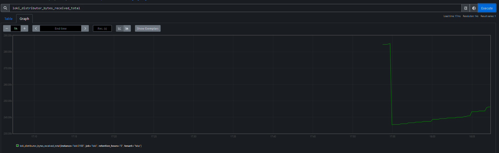
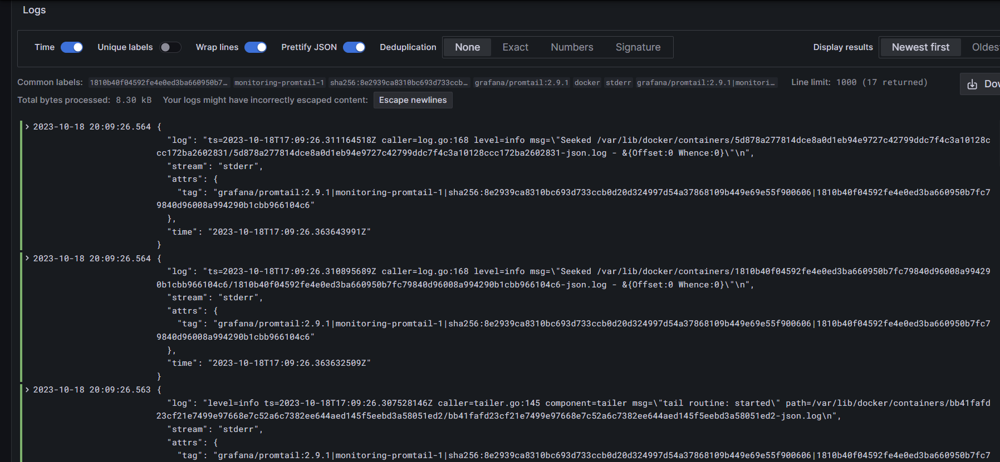
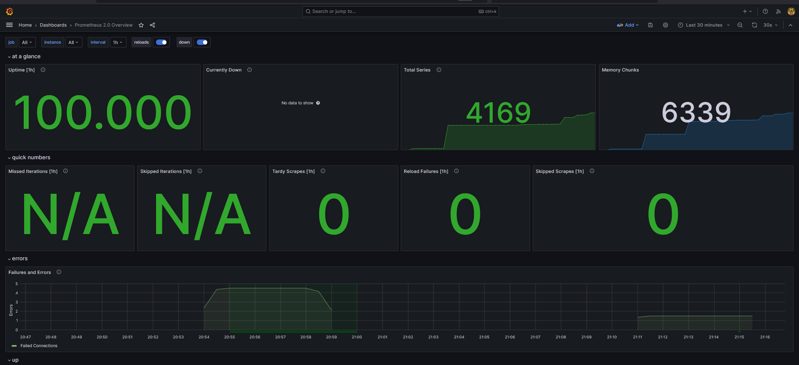
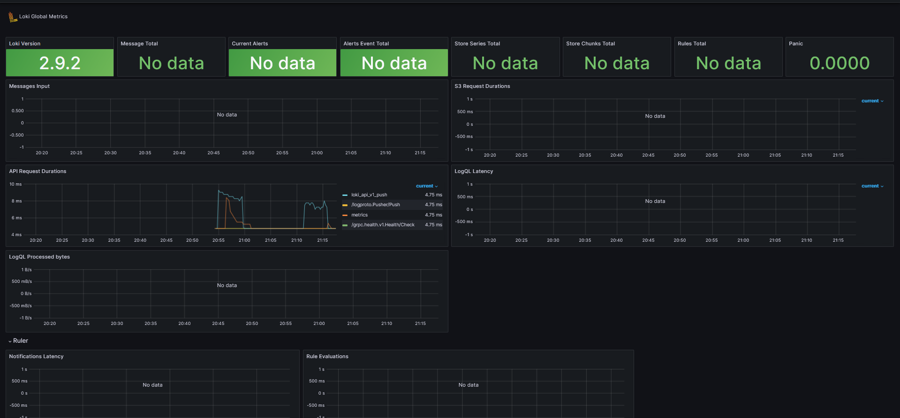

# Monitoring
## Metrics are captured
### Targets

### Some metrics examples

## Grafana dashboards
### Prometheus

### Loki

## Docker compose updates
### Memory limits
Added 512mb to all containers
### Log rotation
Added general configuration for logger `x-logger` that was added to all containers.
